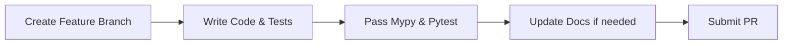

# Contributing to ZCore

First, thank you for considering contributing to ZCore! It is through developers like you that we can continue to refine this architectural chassis for FastAPI.

Please take a moment to review this document to ensure your contributions align with our design philosophy, codebase standards, and development workflows.

---

## 🏛️ Our Design Principles

When proposing changes or writing code for ZCore, please keep these core pillars in mind:
1. **The Complementary Promise:** ZCore must never obscure or lock developers out of native FastAPI/Pydantic capabilities. Your contributions should enhance, not restrict, developer freedom.
2. **Strict Typings:** ZCore is designed with highly strict type safety. All public APIs must be fully annotated and pass static analysis checks without warnings.
3. **Fail-Safe Security:** Security defaults (like magic byte verification or secure fallback JWT checks) should be enforced out-of-the-box, protecting developers from accidental vulnerabilities.
4. **Performance Pragmatism:** Performance over-optimization is a trap, but unnecessary overhead (like repetitive reflection without caching) must be avoided.

### ⛔ What We Don't Accept
To preserve ZCore's lightweight, explicit, and highly predictable nature, we generally avoid:
- **Tight Coupling:** Features that tightly bind ZCore to FastAPI internals or prevent independent unit testing of core components.
- **Implicit "Magic" Behavior:** We prefer explicit, clear configuration over automatic, hard-to-debug "magic" conventions.
- **Breaking Changes:** Any breaking changes submitted without a clearly documented and seamless migration path.
- **Heavy Runtime Overhead:** Third-party dependencies or features that introduce unnecessary CPU/memory overhead (e.g., repetitive reflection without proper caching layers).

---

## 🚦 Before You Contribute

To help us maintain a high-quality codebase and manage our maintainer overhead, please follow these steps before opening an issue or a pull request:

1. **Search Existing Issues:** Ensure the bug or feature request has not already been reported or discussed.
2. **Provide a Minimal Reproducible Example (MRE):** When reporting bugs, please provide a self-contained, copy-pasteable script that reproduces the issue. Issues without a reproduction case may be closed.
3. **Include Environment Information:** Always specify your Python, FastAPI, and ZCore versions, as well as your operating system.

---

## 🛠️ Local Development Setup

ZCore utilizes **Hatch** as its build backend and project manager. Follow these steps to prepare your local development environment:

### 1. Fork and Clone
Fork the repository on GitHub, then clone your fork locally:
```bash
git clone https://github.com/your-username/zcore.git
cd zcore
```

### 2. Install Development Dependencies
It is highly recommended to use a virtual environment. Install ZCore in editable mode along with all optional and development dependencies:
```bash
python -m venv .venv
source .venv/bin/activate  # On Windows: .venv\Scripts\activate

# Install with editable mode and all dev extras
pip install -e ".[all,dev]"
```

---

## 🧪 Testing Guidelines

We aim for high test coverage on core architectural units. ZCore uses `pytest` and `pytest-asyncio` for asynchronous test suites.

### Test Architecture
ZCore's codebase is highly modular. To ensure that components like the Kernel, Plugins, Dependency Injection (DI), Unit of Work (UOW), Router, and Middleware interact correctly, we organize our tests as follows:

```text
tests/
├── unit/                # Tests for isolated, single architectural units with mocks
│   ├── test_repository.py
│   └── test_zchema.py
├── integration/         # Tests verifying interactions between modules
│   ├── test_kernel_startup.py
│   ├── test_plugin_loading.py
│   └── test_request_scope.py
└── e2e/                 # Full end-to-end request/response flows using TestClient
    └── test_crud_flow.py
```

### Running Tests Locally
Run the standard pytest suite using:
```bash
pytest
```

If you prefer to run tests inside Hatch-isolated environments:
```bash
hatch run test
```

### Writing Tests
- **Asynchronous Tests:** Ensure your async tests are decorated with `@pytest.mark.asyncio`.
- **Isolation:** Tests should not leave behind lingering SQLite databases, active sessions, or running background threads.
- **Mocks:** When writing tests that require external services like Redis, implement mock fallbacks where appropriate to ensure the test suite can run fully offline.

---

## 🔍 Code Quality & Static Analysis

Before submitting a Pull Request, your code must satisfy strict formatting, linting, and type-checking constraints.

### 1. Type Checking
ZCore enforces strict type checks via `mypy`. To verify your changes conform to the strict rules defined in `pyproject.toml`, run:
```bash
mypy src/
```

### 2. Linting & Formatting
Ensure your code is clean, PEP-8 compliant, and structured consistently. We recommend using `ruff` for formatting and linting:
```bash
ruff check src/
ruff format src/
```

---

## 📝 Commit Message Conventions

ZCore uses the **Conventional Commits** specification to automate our changelog generation and semantic versioning. Your commit messages must follow this structure:

```text
<type>(<scope>): <description>
```

Common types include:
- `feat`: A new feature (corresponds to a minor version bump).
- `fix`: A bug fix (corresponds to a patch version bump).
- `docs`: Documentation updates.
- `refactor`: Code changes that neither fix a bug nor add a feature.
- `test`: Adding or correcting tests.
- `ci`: Changes to our CI/CD workflows or scripts.

*Examples:*
- `feat(di): add redis plugin support`
- `fix(uow): resolve transaction rollback issue on async commit`
- `docs(zchema): update guide for dynamic schema pruning`

---

## 🚀 Pull Request Process

We appreciate atomic, focused Pull Requests. To increase the chances of your PR being merged quickly, please follow this process:



1. **Branch Naming:** Use descriptive branch names (e.g., `feature/add-s3-provider` or `bugfix/fix-uow-flush`).
2. **Atomic Commits:** Keep your commits focused on single logical changes and adhere to the conventional commits schema.
3. **Documentation:** If you are adding a new feature or modifying an existing protocol, you **must** update the corresponding documentation page under the `docs/` folder.

### 🛡️ CI/CD & Branch Protection
Our repository has strict branch protection rules configured on `master` and `develop`.
- **Mandatory CI Checks:** Your Pull Request cannot be merged unless all status checks (Linting with Ruff, Type-checking with Mypy, and Test Suites with Pytest) pass successfully in our GitHub Actions pipeline.
- **No Direct Pushes:** All code changes must go through a Pull Request. Direct pushes to protected branches are blocked.

---

## 📄 Licensing & Copyright

By contributing to ZCore, you agree that your contributions will be licensed under the project's **Apache License 2.0**.

- **No CLA Required:** We do not currently require a signed Contributor License Agreement (CLA) for individual contributions.
- **Certificate of Origin:** By submitting a Pull Request, you assert that you have the right to submit this code and that it conforms to an open-source contribution under the Apache 2.0 terms.
