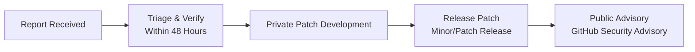

# Security Policy

We take the security of ZCore, and the applications built on top of it, extremely seriously. Security is a core pillar of ZCore's design philosophy, integrated deeply into its architecture [security/jwt.py, security/hashing.py] rather than treated as an afterthought.

If you believe you have found a security vulnerability in ZCore, please read this document to learn how to report it responsibly.

---

## Supported Versions

ZCore is currently in **active beta development**. Security fixes and patches are prioritized and backported to the latest release branches. 

| Version | Status | Security Support Policy |
| :--- | :--- | :--- |
| **0.1.x (Beta)** | Active | Security patches are applied to the latest active beta release |
| **< 0.1.0** | Obsolete | No security support |

*Note: Once stable (1.y.z) releases are published, formal long-term support (LTS) security policies will be established exclusively for stable releases.*

---

## Severity Classification

To help triage reports efficiently, we classify vulnerabilities according to the following severity levels:

| Severity | Description / Examples |
| :--- | :--- |
| **Critical** | Remote Code Execution (RCE) in ZCore core components, SQL Injection caused by a vulnerability in ZCore query generation components. |
| **High** | Authentication bypass, JWT signature forgery, or complete Scoped Context isolation failure. |
| **Medium** | Information disclosure, scoped data leakage (bypass of Zchema projection), or session fixation. |
| **Low** | Minor hardening issues, verbose error tracebacks in non-production environments. |

---

## Reporting a Vulnerability

**Please do not report security vulnerabilities via public GitHub Issues.** 

To report a vulnerability responsibly, please follow this process:

### 1. Send a Private Report
We recommend using **GitHub Private Vulnerability Reporting** as your primary method:
* Go to the "Security" tab of this repository, select "Advisories", and click "Report a vulnerability".

Alternatively, you can contact the maintainer directly at **`alialfostovar@gmail.com`** (the security contact listed in our package metadata).

### 2. What to Include
To help us triage and patch the issue as quickly as possible, please include:
- A clear description of the vulnerability and its potential impact.
- Step-by-step instructions (or a minimal Proof of Concept script) to reproduce the issue.
- Details of the environment where the issue was reproduced (Python version, ZCore version, database driver).

### 3. Disclosure Policy
We ask that you observe the principles of **Responsible Disclosure**:
- Give us reasonable time to investigate and patch the issue before making any information public.
- Do not exploit the vulnerability beyond what is strictly necessary to prove its existence.
- When applicable, security advisories may be coordinated with CVE assignment channels.

---

## Our Resolution Process

1. **Acknowledgment:** We will acknowledge receipt of your report within **48 hours** and begin triaging the issue.
2. **Investigation:** We will work privately to reproduce the vulnerability. If verified, we will develop a fix in a private branch.
3. **Patch Release:** We will release a patch as a new minor or patch version (e.g., `0.1.1`).
4. **Advisory:** We will publish a GitHub Security Advisory (GHSA) and coordinate CVE assignment if applicable.

---

## Out of Scope

The following are generally **not considered** security vulnerabilities in ZCore:
- **Application Misconfiguration:** Failing to configure secure environment variables (e.g., exposing database credentials).
- **Intentionally Disabled Features:** Disabling built-in security middlewares or choosing not to use Zchema projection.
- **Weak Credentials:** Brute-force or weak password choices by end-users (which are managed by application-level authentication logic).
- **Debug Mode:** Leaving FastAPI's debug or reload mode enabled in production.

---

## Hardened Defaults in ZCore

ZCore is built with strict, "secure-by-default" configurations [security/jwt.py, storage/local.py]:
- **Production Secret Guard:** The framework will raise a fatal traceback and refuse to start in a production environment if the default fallback `SECRET_KEY` is detected [security/jwt.py]. 
- **Argon2id default configuration:** We enforce high-entropy password hashing out-of-the-box [security/hashing.py].
- **Path Traversal Protection:** The local storage provider strictly verifies resolved filesystem paths before running write or unlink operations [storage/local.py].

*Note: ZCore only fails-fast (crashes) on fatal security configurations. Missing optional configuration elements (e.g., optional caching backends) will only raise non-fatal warnings.*