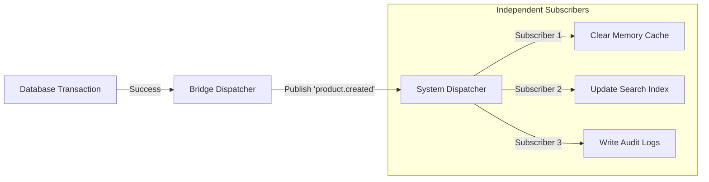

# 🔔 Database Lifecycle Events

Database lifecycle events provide a modest way to listen for database modifications and trigger external actions without cluttering your core business logic. This module acts as a bridge, connecting database operations to ZCore's central event dispatcher.

---

## 🌉 The Coordination Bridge

To allow the database layer to communicate with other parts of your system, you must register the kernel's event dispatcher. This setup is handled automatically during the framework bootstrapping in `main.py`.

```python
# Internal bridge mechanism
_global_dispatcher: EventDispatcher | None = None

def register_db_event_dispatcher(dispatcher: EventDispatcher) -> None:
    """Register the global dispatcher to bridge database events to the system."""
    global _global_dispatcher
    _global_dispatcher = dispatcher
```

This simple registration allows any repository or service operation to publish events that other modules (like logging or search) can listen to.

---

## 🛡️ Resilient & Async Dispatching

Database operations must remain fast and responsive. To ensure that event handlers do not slow down your database, ZCore dispatches these events **asynchronously**. 

Furthermore, the system is designed to be resilient: if an event handler fails, the error is caught and logged, but it **will not** crash your database transaction.

| Feature | Behavior | Benefit |
| :--- | :--- | :--- |
| **Non-blocking** | Events run in the background. | Database performance is preserved. |
| **Isolated Failures** | Handler errors are caught. | A failing log listener won't stop a product save. |
| **Type Safety** | Payloads can be any object. | Flexible data sharing between modules. |

---

## 📐 Real-world Coordination

The event bridge is ideal for keeping disparate parts of your application in sync without them being "hard-coded" together.



---

## 💡 Engineering Insights

!!! tip "💡 Decoupling Your Modules"
    By using lifecycle events, modules like **Search Indexing** or **Audit Logging** can "observe" database changes from a distance. Your core `ProductService` remains clean and simple because it doesn't need to know that a search index or an audit log even exists.

!!! info "🛡️ Transaction Integrity"
    ZCore typically dispatches these events only after the database session has successfully committed. This ensures that you don't send a "Welcome Email" or "Order Confirmation" for a transaction that ultimately failed and was rolled back.
