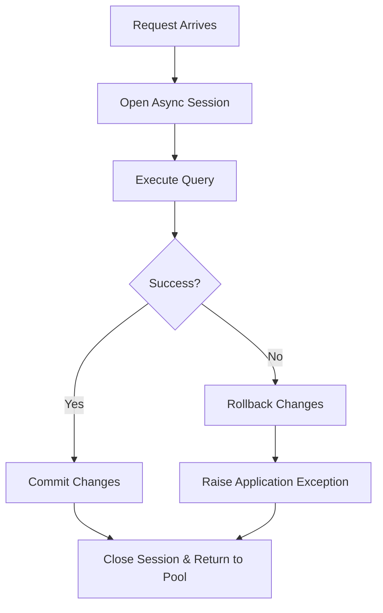

# 🗄️ Database Infrastructure & Connection Pool

ZCore provides a modest and practical database infrastructure built on top of **SQLAlchemy 2.0 (Asyncio)** and `aiosqlite`. It is designed to handle the repetitive tasks of connection pooling, transactional integrity, and permission mapping so you can focus on your data structures.

---

## 🏗️ The Database Manager (`DatabaseManager`)

The central `DatabaseManager` coordinates the lifecycle of the asynchronous SQL engine. It is responsible for creating a stable connection to your database and ensuring that sessions are available when a request arrives.

### ⚙️ Connection Pool Configuration
To prevent resource exhaustion, ZCore automatically tunes the connection pool based on your database engine. While SQLite is ideal for development, server-based databases (like PostgreSQL) require more granular control.

| Configuration Parameter | Purpose | SQLite Behavior | Server Databases (e.g. PostgreSQL) |
| :--- | :--- | :--- | :--- |
| **`pool_size`** | Number of persistent connections kept open. | Bypassed | Configurable (Default: `5`) |
| **`max_overflow`** | Temporary connections allowed beyond `pool_size`. | Bypassed | Configurable (Default: `10`) |
| **`pool_recycle`** | Time before a connection is refreshed to prevent timeouts. | Bypassed | Configurable (Default: `1800s`) |
| **`pool_pre_ping`** | Validates connections before use to avoid stale sockets. | ✅ Enabled | ✅ Enabled |

---

## 🔄 Session Lifecycle Management

Database sessions in ZCore follow a strict asynchronous lifecycle. This ensures that every database interaction is wrapped in a transaction that is either fully completed or safely rolled back.



!!! info "🛡️ Automated Rollbacks"
    If an unhandled error occurs anywhere inside your business logic or repository, the `DatabaseManager` automatically triggers an asynchronous rollback. This prevents "partial data" from being saved and keeps your database consistent.

---

## 📋 Declarative Base & Standardized Permissions

ZCore's declarative `Base` model provides a foundation for your entities. Beyond standard SQLAlchemy features, it includes a modest utility to generate table-level permission actions automatically.

### 🛡️ Permission Mapping Engine (`Actions`)
For every model inheriting from `Base`, ZCore generates a set of unique permission strings. These are derived from the `__tablename__` property and provide a standardized way to handle authorization.

```python
# Example: Using the Product model from our Quickstart
class Product(Base):
    __tablename__ = "products"
    ...

# ZCore automatically generates these action keys:
# Product.actions().LISTVIEW -> "products:listview"
# Product.actions().VIEW     -> "products:view"
# Product.actions().CREATE   -> "products:create"
# Product.actions().UPDATE   -> "products:update"
# Product.actions().DELETE   -> "products:delete"
```

---

## 💡 Engineering Insights

!!! tip "💡 Dependency Injection Integration"
    You rarely need to interact with the `DatabaseManager` directly. By using `SessionDep`, ZCore automatically injects a ready-to-use, request-scoped session into your repositories.
    ```python
    def __init__(self, db: SessionDep):
        self.db = db # An active, managed AsyncSession
    ```

!!! note "🛡️ Metadata Engine"
    The `Base` class stores all your table definitions in a central metadata registry. This makes it easy to integrate with migration tools like **Alembic** for managing database schema changes over time.
