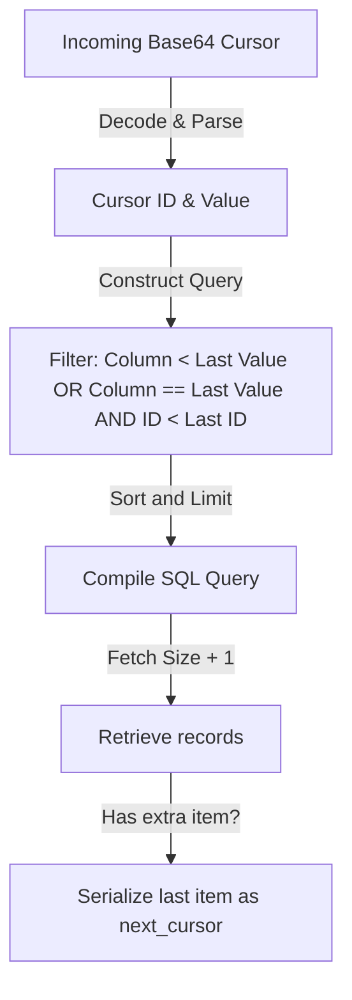

# 📊 Database Pagination

ZCore provides two modest strategies for managing large datasets: **Offset-based** (`PageNumberPagination`) and **Keyset-based** (`CursorPagination`). Choosing the right strategy depends on your application's specific performance requirements and data stability needs.

---

## ⚖️ Pagination Strategies Comparison

Selecting a strategy is a balance between flexibility and performance. Use the table below to guide your decision:

| Metric | Offset-based (🐢) | Keyset-based (🚀) |
| :--- | :--- | :--- |
| **Performance** | Degrades as you go deeper into pages (`O(N)`). | Remains stable regardless of depth (`O(1)`). |
| **Data Drift Safety** | Risk of missing or seeing duplicate items. | Safe across real-time, dynamic datasets. |
| **Sorting** | Highly flexible (sort by any column). | Restricted (optimized for the cursor field). |
| **Total Count** | Included (enables "Page 1 of 10"). | Usually omitted (enables "Load More"). |
| **Ideal Use Case** | Admin tables, low-traffic dashboards. | Infinite scrolls, high-traffic mobile feeds. |

---

## 1. Offset Pagination (`PageNumberPagination`)

This is the most common approach. It mimics how humans think about books—flipping to a specific page number.

### 🛡️ Built-in Safety
To prevent malicious SQL injection or unexpected errors, ZCore validates that your requested sorting column actually exists on the database model before the query is executed:

```python
# Internal validation check
valid_columns = {col.key for col in inspect(model).columns}
if params.sort_by not in valid_columns:
    raise ValidationError(message=f"Invalid sort field: '{params.sort_by}'")
```

### 📋 Standardized Metadata
The pagination engine returns a consistent metadata object to help your frontend navigate the data:
```json
{
  "total": 150,
  "page": 2,
  "size": 20,
  "total_pages": 8,
  "has_next": true,
  "has_prev": true
}
```

---

## 2. Keyset Pagination (`CursorPagination`)

Keyset pagination uses "reference coordinates" to identify exactly where the last page ended. This avoids the heavy lifting of skipping over thousands of rows (offsets), making it much faster for large tables.

### 📐 Execution Flow
The following diagram illustrates how ZCore handles an incoming cursor to find the next set of data:



### 🔒 Cursor Serialization
For safety and ease of use, cursors are encoded as URL-safe base64 strings. A ZCore cursor payload identifies a record using two fields to ensure precision, even if multiple records share the same timestamp:

```python
# Example of the internal coordinate payload
payload = {
    "value": "2023-10-27T10:00:00", # The sort value (e.g., created_at)
    "id": "uuid-123-456"            # The primary key for uniqueness
}
```

---

## 💡 Engineering Insights

!!! tip "💡 Choosing the Right Tool"
    If your table has fewer than 10,000 rows, **Offset Pagination** is perfectly fine and easier to implement for frontend teams. Move to **Cursor Pagination** when your data volume grows or when you need a smooth, infinite-scrolling experience.

!!! info "🛡️ Drift Protection"
    Data "drift" happens when a new item is added to Page 1 while a user is browsing Page 2. In Offset pagination, this causes an item to "shift" and appear again on Page 2. Cursor pagination prevents this because it anchors the query to a specific record, not a page number.
