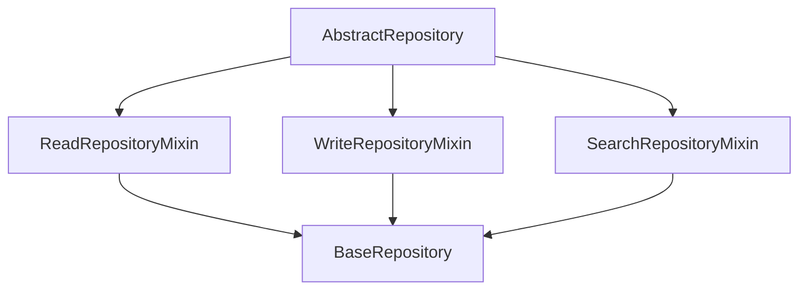

# 🏛️ Repository Pattern

ZCore uses the **Repository Pattern** to isolate data access logic from your core business logic. This modest abstraction ensures that your database interactions are consistent, reusable, and easy to test, regardless of how complex your queries become.

---

## 📐 Generic Repository Architecture

The `BaseRepository` is built using specialized mixins. This design allows you to understand exactly what capabilities a repository has based on the mixins it inherits.



---

## 🔍 1. Read Operations (`ReadRepositoryMixin`)

The read mixin manages safe and optimized database queries. It handles everything from simple lookups to complex lists.

### ⚡ Fast-Path Optimization
Database round-trips can be expensive. ZCore includes a modest optimization in `get_by_ids`: if an empty list is passed, it bypasses the database entirely and returns an empty sequence, saving unnecessary network latency.

```python
async def get_by_ids(self, ids: List[Any], ...) -> Sequence[ModelType]:
    # Fast path: Skip database hit entirely if input is empty
    if not ids:
        return []
        
    query = select(self.model).where(self.pk.in_(ids))
    result = await self.db.execute(query)
    return result.scalars().all()
```

---

## 📝 2. Write Operations (`WriteRepositoryMixin`)

The write mixin handles the creation, modification, and removal of database records. 

### 🔄 Flush Over Commit (UoW Harmony)
To coordinate with ZCore's **Unit of Work** pattern, repositories do not call `commit()` directly. Instead, they use `flush()`. This pushes your changes to the database's transaction log and retrieves auto-generated fields (like IDs) without ending the transaction. This allows the Unit of Work to decide when the final "Save" happens.

| Method | Database Action | Lifecycle Behavior |
| :--- | :--- | :--- |
| ✨ `create` | `INSERT` | Flushes and refreshes the instance. |
| 🛠️ `update` | `UPDATE` | Applies partial or full patches to a record. |
| 🗑️ `delete` | `DELETE` | Removes the record from the session context. |

---

## 🧪 3. Dynamic Search (`SearchRepositoryMixin`)

This mixin bridges your repository with ZCore's **Search Engine**. It allows you to perform complex, policy-validated searches with minimal code.

```python
async def search(self, search_in: SearchRequest, pagination: Any = None) -> Any:
    from zcore.db.search import SearchEngine
    engine = SearchEngine(self.model)
    query = engine.build_base_query(search_in)
    
    if pagination is None:
        result = await self.db.execute(query)
        return result.scalars().all()
        
    # Automatically chooses Cursor or Page pagination based on params
    paginator = CursorPagination(self.cursor_field) if isinstance(pagination, CursorParams) else PageNumberPagination()
    return await paginator.paginate(self.db, query, pagination, self.model)
```

---

## 💡 Engineering Insights

!!! info "🛡️ Type Safety & Generics"
    By utilizing Python Generics (`BaseRepository[Model, CreateSchema, UpdateSchema]`), ZCore provides full IDE auto-completion. This ensures that you don't accidentally pass an `OrderUpdate` schema to a `ProductRepository`.

!!! tip "💡 Custom Query Extensions"
    If you need highly specialized SQL (e.g., complex reporting or raw queries), we suggest extending the repository class in your domain module. This keeps all SQL-related code in one place, separate from your business rules.
    ```python
    class ProductRepository(BaseRepository[...]):
        async def get_out_of_stock_by_category(self, category_id: int):
            # Write your custom SQLAlchemy query here
            ...
    ```
