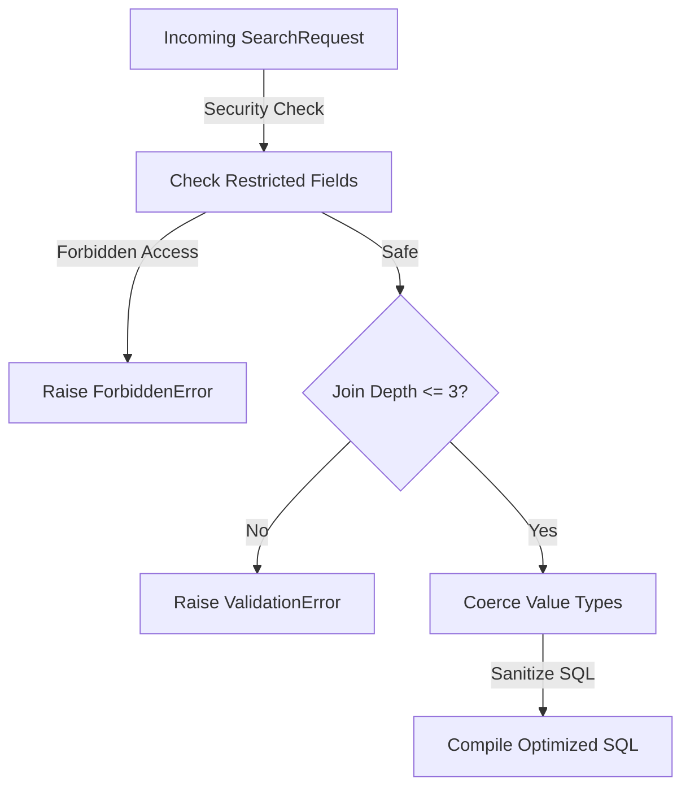

# 🔍 Dynamic Search Engine

ZCore’s search engine is a modest tool designed to handle the heavy lifting of data discovery. It translates client-supplied criteria—like nested filters, sorting rules, and relationship preloading—into safe and performant database queries without requiring you to write custom SQL for every request.

---

## 🛡️ Safety & Security Layers

Dynamic query interfaces can be risky if not properly guarded. To prevent SQL injection, performance exhaustion, or unauthorized data access, the `SearchEngine` implements several engineering safeguards.



### 1. Restricted Field Guard
Before a query is even compiled, the engine cross-references all requested fields and paths against the active security context. If a user is not authorized to see a field (e.g., `internal_cost` or `hashed_password`), the engine blocks the query immediately.

```python
# Internal logic: matches paths like 'resource.owner.id'
if normalized_path == normalized_restricted or normalized_path.startswith(normalized_restricted + "."):
    return True # Block access
```

### 2. Relationship Depth Limits
Deep joins (e.g., fetching a product's category's owner's profile) can significantly slow down a database. To maintain stability, ZCore limits relationship preloading to a maximum depth of **3 levels**.

### 3. Wildcard Sanitization
To prevent "expensive" string searches that can lock up database resources, ZCore automatically escapes SQL wildcards (`%` and `_`) provided by the client. This ensures that `ilike` operations behave exactly as expected without unintended side effects.

### 4. Smart Type Coercion
Since search parameters arrive as JSON (strings, numbers, or booleans), the engine intelligently converts them to the correct Python types required by your database columns, such as `UUID`, `datetime`, or `Decimal`.

---

## 🧪 Search Request Structure

The `SearchRequest` is a structured way for clients to ask for exactly what they need. It is divided into four main parts:

| Component | Purpose | Example |
| :--- | :--- | :--- |
| **`filters`** | Logical conditions for finding data. | `price > 100 AND stock > 0` |
| **`include`** | Related data to "eager load" in one go. | `["category", "tags"]` |
| **`sort`** | The order of the results. | `[{"field": "created_at", "order": "desc"}]` |
| **`pagination`** | How many items to return and where to start. | `size: 20, page: 1` |

### Example Payload
```json
{
  "filters": [
    { "field": "stock", "op": "gt", "value": 0 },
    {
      "op": "or",
      "items": [
        { "field": "name", "op": "ilike", "value": "coffee" },
        { "field": "tags.name", "op": "eq", "value": "organic" }
      ]
    }
  ],
  "include": ["category"],
  "sort": [{ "field": "price", "order": "asc" }]
}
```

---

## 🛠️ Supported Operators

The search engine supports a practical set of operators to handle most real-world filtering needs:

| Operator | SQL equivalent | Description |
| :--- | :--- | :--- |
| `eq` / `ne` | `=` / `!=` | Equals or Not-Equals. |
| `gt` / `lt` | `>` / `<` | Greater-than or Less-than. |
| `ge` / `le` | `>=` / `<=` | Greater-or-equal or Less-or-equal. |
| `ilike` | `ILIKE` | Case-insensitive partial string match. |
| `in` | `IN (...)` | Matches any value in a provided list. |
| `is_null` | `IS NULL` | Checks if a field is empty (or not). |
| `or` / `and` | `OR` / `AND` | Logical grouping for complex filters. |

---

## 💡 Engineering Insights

!!! tip "💡 Why use `include`?"
    Using the `include` field allows you to fetch related data in a single database round-trip. ZCore uses **Joined Loading** for single items and **Select-In Loading** for collections, ensuring the most efficient query pattern is used automatically.

!!! info "🛡️ Access Denied?"
    If you receive a `ForbiddenError` during a search, it is likely because one of the fields in your `filters`, `sort`, or `include` has been restricted in the current request context. This is ZCore's way of preventing accidental data exposure.
