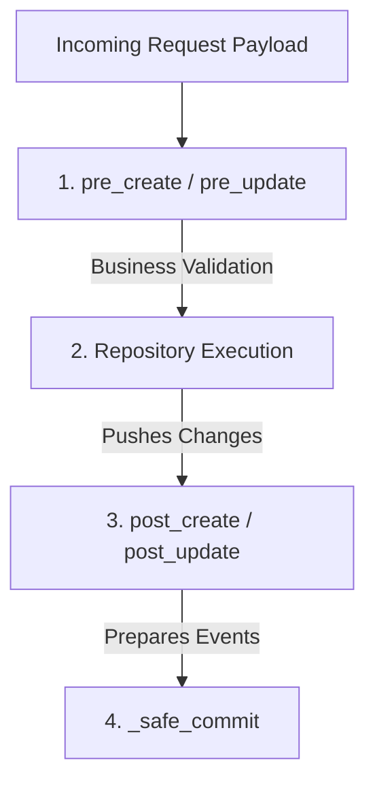

# ⚙️ Business Logic Layer (Base Service)

The service layer is the modest heart of your application's logic. It acts as a bridge between the raw data access of the Repository and the web requests of the Router. Its primary job is to orchestrate business rules and ensure that database transactions are handled safely and atomically.

---

## 🎣 Base Service Lifecycle Hooks

ZCore's `BaseService` provides built-in "hooks" that run automatically around database modifications. These hooks allow you to validate, clean, or enrich your data without cluttering the core logic of saving to the database.



### 📋 Available Lifecycle Hooks

| Hook | Phase | Primary Use Case |
| :--- | :--- | :--- |
| ✨ `pre_create` | Before SQL Insert | Data sanitization and domain-level validation. |
| ✅ `post_create` | After SQL Insert | Triggering side effects like logging or metrics. |
| 🛠️ `pre_update` | Before SQL Update | Checking permissions or calculating derived fields. |
| 🔄 `post_update` | After SQL Update | Invalidating caches or notifying other systems. |
| 🗑️ `pre_delete` | Before SQL Delete | Verifying that the record can be safely removed. |

---

## 🛡️ Transaction Isolation & Safe Commits

One of the most challenging problems in complex systems is the **Nested Commit Problem**. If multiple services each try to "save" (commit) their own work, it becomes impossible to run them all together in a single atomic transaction. If the second service fails, the first one has already saved its data, leading to a corrupted state.

ZCore solves this modestly through the `_safe_commit` mechanism. This helper checks if the current operation is part of a larger **Unit of Work**:

```python
async def _safe_commit(self) -> None:
    session_info = self.repository.db.info
    
    # If the session is wrapped in a UnitOfWork, we stay quiet and let UOW handle the commit.
    if not session_info.get("uow_managed", False):
        try:
            await self.repository.db.commit()
        except Exception:
            await self.repository.db.rollback()
            raise
```

### 💡 How it works in practice:

*   **Standalone Mode**: When you call a service method normally, it commits its own changes immediately.
*   **Orchestrated Mode**: When you call multiple service methods inside a `UnitOfWork` block, ZCore sets `uow_managed` to `True`. The services skip their individual commits, allowing the Unit of Work to commit everything at once at the very end.

---

## 💻 Practical Usage

When building your services, you can easily tap into these hooks to enforce business rules:

```python
from zcore.service.base import BaseService
from zcore.exceptions.base import ValidationError
from products.schemas import ProductCreate, ProductUpdate
from products.models import Product

class ProductService(BaseService[Product, ProductCreate, ProductUpdate]):
    
    async def pre_create(self, schema: ProductCreate) -> None:
        """Enforce business rules before data reaches the repository."""
        if schema.price > 10000 and schema.stock < 5:
            raise ValidationError(
                message="High-value products must be initialized with a minimum of 5 items."
            )
            
    async def post_create(self, model: Product) -> None:
        """Logic to run after the database has flushed the new record."""
        # This is a safe place to prepare a 'product.created' event.
        pass
```

---

## 💡 Engineering Insights

!!! tip "💡 Validation vs. Sanitization"
    Use `pre_create` for **Business Logic Validation** (e.g., "Is this user allowed to buy this?"). Use Pydantic schemas for **Structural Validation** (e.g., "Is this field an integer?"). This keeps your service layer focused on rules rather than data types.

!!! info "🛡️ Automatic Rollbacks"
    If an exception is raised inside a `pre_` hook or during the repository call, ZCore will prevent the commit and ensure the database session is rolled back. Your data remains safe and consistent.
