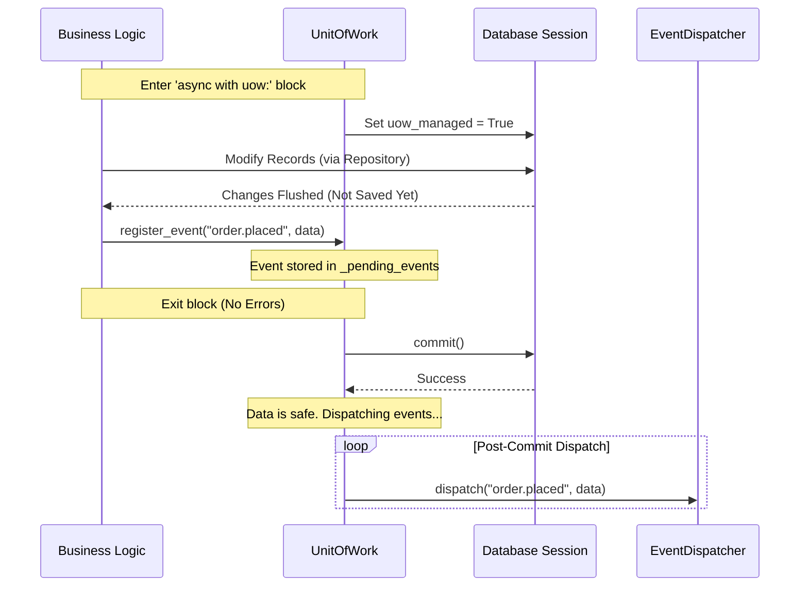

# 🔗 Unit of Work (UOW) Pattern

The Unit of Work (UOW) pattern is a practical way to coordinate multiple database changes and manage system-wide events. It ensures that complex operations involving several services or repositories succeed or fail as a single, atomic unit, while preventing "partial saves" that could corrupt your data.

---

## 📐 Transactional Lifecycle Flow

The `UnitOfWork` class manages the database session and maintains a modest internal queue (`_pending_events`). This queue buffers domain events (like sending a "Welcome Email") so they are only triggered **after** the data is safely committed to the database.



---

## 🛠️ Automated Transactional Boundaries

ZCore utilizes the asynchronous context manager protocol (`async with`) to automate the start and end of your transactions. This removes the need for manual `commit()` or `rollback()` calls in your business logic.

| Phase | Behavior | Purpose |
| :--- | :--- | :--- |
| 🏁 **Entry** | Sets `uow_managed = True`. | Tells internal services to skip their individual commits. |
| 🛑 **Exception** | Triggers `rollback()`. | Discards all changes if any part of the block fails. |
| ✅ **Success** | Triggers `commit()`. | Saves all changes to the database permanently. |
| 🛡️ **Exit** | Sets `uow_managed = False`. | Cleans up the session state for the next operation. |

---

## 🛡️ Safe Post-Commit Event Dispatching

A common engineering pitfall is dispatching external actions—like sending an SMS or notifying a payment gateway—before the database has actually saved the data. If the database save fails at the last millisecond, your system becomes inconsistent (e.g., a customer gets a "Thank You" email for an order that was never saved).

ZCore solves this by buffering events. Events are only dispatched if `session.commit()` is successful:

```python
async def commit(self) -> None:
    try:
        await self.session.commit()
    except Exception as e:
        logger.error(f"Transaction commit failed: {e}")
        await self.session.rollback()
        raise

    # Only reached if the database save was 100% successful
    while self._pending_events:
        event_name, payload = self._pending_events.pop(0)
        try:
            await self.dispatcher.dispatch(event_name, payload)
        except Exception as ex:
            # Failed handlers are logged but don't break the transaction
            logger.error(f"Event handler failed for event '{event_name}': {ex}")
```

---

## 💻 Practical Usage

Using the Unit of Work is straightforward. It is designed to wrap around your service calls:

```python
async def process_checkout(self, user_id, cart_items):
    # The UOW ensures both order creation and inventory update succeed together
    async with UnitOfWork(self.session, self.dispatcher) as uow:
        order = await self.order_service.create_order(user_id, cart_items)
        await self.stock_service.reduce_inventory(cart_items)
        
        # Register an event that runs only after a successful save
        uow.register_event("order.processed", {"order_id": order.id})
```

---

## 💡 Engineering Insights

!!! tip "💡 Ensuring Atomicity"
    The Unit of Work is your best tool for ensuring **Atomicity**. If your `reduce_inventory` call fails, the `order` created just a line above will be automatically rolled back from the database as if it never happened.

!!! info "🛡️ Fault Isolation"
    ZCore wraps every event handler in a `try/except` block. This ensures that if a "Welcome Email" service is temporarily down, it won't crash your entire checkout process or prevent other listeners from working.
