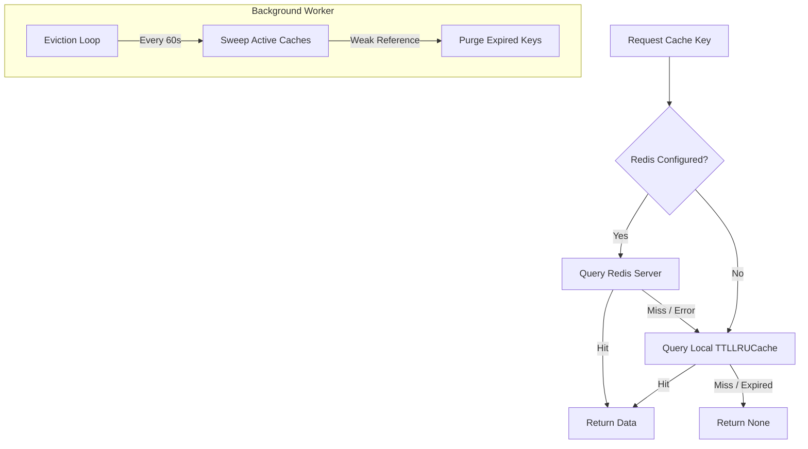

# ⚡ Distributed Caching & Local Eviction

ZCore features a practical hybrid caching strategy. It utilizes a modest, thread-safe local cache (`TTLLRUCache`) as its primary layer, with the ability to scale to a distributed Redis cache when your environment requires it. This "two-tier" approach ensures that even if your central cache server goes offline, your application remains responsive.

---

## 📐 Technical Architecture

The caching system is designed to prioritize speed while maintaining a safety net. It automatically coordinates between in-memory storage and external distributed storage.



---

## 🏢 1. Local Layer: The TTLLRUCache

The local cache is a modest but robust in-memory store. It combines **Least Recently Used (LRU)** eviction with **Time-To-Live (TTL)** expiration to keep your memory footprint small.

*   **🛡️ Thread Safety**: Active read/write operations use reentrant locks (`threading.Lock()`). This prevents data corruption when multiple threads or tasks access the cache simultaneously.
*   **📉 LRU Eviction**: When the cache reaches its `maxsize` (default: 1000), it automatically discards the oldest, least-accessed items to make room for new ones.
*   **🧹 Memory Leak Protection**: ZCore uses **Weak References** (`weakref.WeakSet`) to track active caches. This allows the Python garbage collector to remove cache instances from memory as soon as they are no longer needed, even if the background eviction loop is still running.

---

## 🌍 2. Distributed Layer: BaseCache Abstraction

The `BaseCache[T]` class provides a transparent interface. You don't need to write separate logic for Redis or local storage; the framework handles the "fallback" logic for you.

### 🧪 Structured Data & Validation
When you retrieve data, ZCore doesn't just return a raw string. It automatically decodes the JSON and can validate it against a **Pydantic model**. This ensures that your cached data always matches the expected structure.

```python
# Internal validation logic
parsed_data = json_loads(raw_val)
if target_type:
    return target_type.model_validate(parsed_data)
```

---

## 🔄 Lifecycle Management

ZCore manages the cache lifecycle through two modest functions typically called during application startup and shutdown.

| Function | Responsibility |
| :--- | :--- |
| **`init_cache()`** | Connects to Redis and starts the background task that purges expired local keys every minute. |
| **`close_cache()`** | Stops the background worker and safely closes any open Redis connections. |

---

## 💻 Practical Usage

We suggest defining your caches within your domain modules. This keeps your keys organized and avoids naming collisions.

```python
from zcore.cache.base import BaseCache
from pydantic import BaseModel

# 1. Define what your cached data looks like
class ProductCache(BaseModel):
    id: str
    price: float

# 2. Create a namespaced cache instance
cache = BaseCache[ProductCache](prefix="products")

# 3. Set a value with a 1-hour expiration (TTL in seconds)
await cache.set("p_101", {"id": "p_101", "price": 29.99}, ttl=3600)

# 4. Get the value back as a validated Pydantic object
product = await cache.get("p_101", target_type=ProductCache)
```

---

## 💡 Engineering Insights

!!! tip "💡 Graceful Fallback"
    The caching system is designed for **Resilience**. If your Redis server encounters a network timeout or a crash, ZCore logs a warning and immediately tries to find the data in the local memory. Your users likely won't even notice the disruption.

!!! info "🛡️ Namespace Isolation"
    Always use a `prefix` when initializing `BaseCache`. This ensures that a key named `101` in your "products" module doesn't overwrite a key named `101` in your "orders" module inside the shared Redis database.

!!! warning "🧹 The Eviction Loop"
    Remember to call `init_cache()` in your `main.py` or startup plugin. Without it, the background worker won't start, and expired local keys will remain in memory until the `maxsize` limit is reached.
