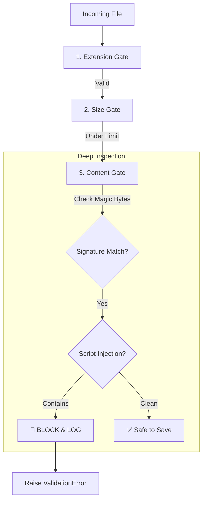

# 📁 File Storage & Security Validators

ZCore provides a modest and reliable file storage system managed by the `StorageProvider` interface. It is designed to handle file uploads, raw binary streaming, and secure deletions while enforcing strict practical safeguards to protect your host system from malicious activities.

---

## 🏠 Local Storage Provider (`LocalStorageProvider`)

The `LocalStorageProvider` is the default implementation for managing files on your server's filesystem. It focuses on two core engineering principles: **Isolation** and **Predictability**.

### 🛡️ Traversal Exploit Mitigation
A common security risk is "Path Traversal," where a user provides a filename like `../../etc/passwd` to access sensitive system files. ZCore mitigates this by resolving every path to its absolute physical location and verifying it remains within your configured `base_path`.

```python
# Internal safety check
base = await Path(self.base_path).resolve(strict=False)
target_folder = await (Path(self.base_path) / folder_name).resolve(strict=False)

if not target_folder.is_relative_to(base):
    raise AppException("Path traversal attempt detected")
```

### 🔢 Collision-Resistant Filenames
To prevent users from overwriting each other's files and to hide original filenames (which might contain sensitive information), ZCore renames every upload using a randomized 15-character UUID while preserving the original extension.

| Original Filename | Generated ZCore Path |
| :--- | :--- |
| `vacation_photo.jpg` | `uploads/images/a1b2c3d4e5f6g7h.jpg` |
| `report_2023.pdf` | `uploads/docs/z9y8x7w6v5u4t3s.pdf` |

---

## 🚦 Upload Validation Pipeline

Every file passing through the storage system must clear a series of "security gates." If a file fails any gate, the process is aborted, and no data is written to your disk.



### 1. FileExtensionValidator
This gate performs a case-insensitive check. Whether a user uploads `image.PNG` or `image.png`, the validator normalizes the input to ensure it matches your allowed list.

### 2. MaxFileSizeValidator
To defend against **Denial of Service (DoS)** attacks where a user attempts to fill your hard drive with massive files, this validator enforces a strict size limit. It uses an efficient "seek" method to determine file size without loading the entire file into memory.

### 3. SafeMimeTypeValidator (The "Magic Byte" Check)
Simply checking a file extension is not enough, as a user could rename a malicious script to `photo.jpg`. ZCore inspects the first **2048 bytes** of the file to verify its "Magic Bytes"—the unique digital signature that identifies true file types (e.g., PNGs always start with specific bytes).

#### 🛡️ Malicious Pattern Blocking
The validator scans the file header for high-risk patterns. ZCore will automatically block and log any file containing:
*   🐘 **PHP Tags:** `<?php`
*   📜 **HTML Scripts:** `<script`
*   💻 **Executables:** Windows `MZ` headers or Unix `#!/` shebangs.

---

## 💻 Practical Usage

We suggest configuring your storage providers inside your domain plugins or service initialization.

```python
from zcore.storage.local import LocalStorageProvider
from zcore.storage.validators import (
    FileExtensionValidator, 
    MaxFileSizeValidator, 
    SafeMimeTypeValidator
)

# 1. Define your security policy
image_policy = [
    FileExtensionValidator(allowed_extensions=[".png", ".jpg", ".webp"]),
    MaxFileSizeValidator(max_size_mb=2.0),
    SafeMimeTypeValidator(allowed_mimes=["image/png", "image/jpeg", "image/webp"])
]

# 2. Initialize the provider
avatar_storage = LocalStorageProvider(
    base_path="./data/avatars", 
    validators=image_policy
)

# 3. Use it in your service
# path = await avatar_storage.upload(uploaded_file, folder="users")
```

---

## 💡 Engineering Insights

!!! tip "💡 Temporary Files"
    ZCore utilizes `anyio` and `aiofiles` for all storage operations. This means file I/O is non-blocking, allowing your server to handle other requests while large files are being written to disk.

!!! warning "🛡️ The Base Path"
    Ensure your `base_path` is outside your application's source code directory. This follows the principle of **Separation of Concerns** and ensures that uploaded files cannot accidentally overwrite your Python scripts.

!!! info "🧪 Testing Validations"
    When testing your API, try uploading a text file renamed to `.jpg`. You should see the `SafeMimeTypeValidator` correctly identify and block the file because its internal signature does not match a real JPEG.
