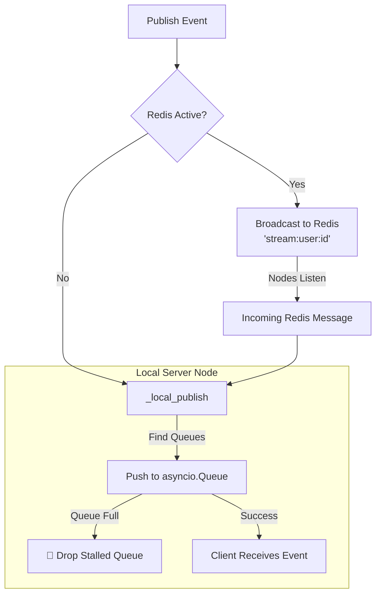

# 📡 Real-Time Event Streaming (PubSub)

ZCore includes a modest and practical event streaming system managed by the `StreamManager`. It is designed to handle real-time communication—such as notifications, live updates, or activity feeds—by coordinating events between your server and connected clients. It supports scaling across multiple server nodes using Redis, while maintaining a reliable fallback for local development.

---

## 📐 How Streaming Works

The streaming subsystem manages active listener connections and ensures that when an event is "published," it reaches the correct "subscriber," regardless of which server node they are connected to.



---

## 1. Local Queue & Connection Scoping

When a client (like a browser or mobile app) wants to receive live updates, ZCore creates a private "mailbox" for that connection using an `asyncio.Queue`. 

### 🛡️ Context-Safe Subscriptions
To prevent "ghost connections" and memory leaks, ZCore uses an asynchronous context manager. This guarantees that as soon as a user disconnects or the request ends, their queue is automatically removed and cleaned up.

```python
# Usage inside a route
async with stream_manager.subscription(user_id) as queue:
    # While the connection is open, wait for new mail
    data = await queue.get() 
    # Send data to client...
# Once the block exits, the queue is destroyed automatically.
```

---

## 2. Scaling Across Multiple Nodes

In a production environment with multiple servers, a user might be connected to **Server A**, but the event that triggers their notification happens on **Server B**. 

ZCore solves this using **Redis PubSub**. When an event is published, it is broadcast to a specific channel (`stream:user:<user_id>`). Every server in your cluster listens to these channels. When **Server A** hears the message from Redis, it checks if that user is connected locally and delivers the message to their queue.

| Feature | Single Node | Multi-Node (Redis) |
| :--- | :--- | :--- |
| **Delivery** | Direct memory transfer. | Broadcast via Redis. |
| **Latency** | Near-zero. | Minimal (Network hop). |
| **Complexity** | Very Low. | Modest (Requires Redis). |

---

## 3. 🛡️ Memory & Overflow Protection

Real-time systems can be vulnerable if a client connection "stalls" (stops reading data but stays connected). If the server keeps pushing events into a stalled queue, it will eventually run out of memory.

ZCore protects your server by enforcing a **Max Size** on every queue. If a queue reaches 100 pending events and the client still hasn't read them, ZCore modestly assumes the connection is dead or unhealthy and drops that specific queue to protect system resources.

```python
# Internal safety logic
try:
    queue.put_nowait(data) # Try to deliver instantly
except asyncio.QueueFull:
    # If the client is too slow, remove them to save memory
    self.users_queues[user_id].remove(queue)
```

---

## 💻 Practical Usage (SSE Example)

We suggest using **Server-Sent Events (SSE)** for simple one-way real-time updates. It is lightweight and works natively in modern browsers.

```python
import uuid
from fastapi import APIRouter
from fastapi.responses import StreamingResponse
from zcore.web.streams import StreamManager

router = APIRouter()
stream_manager = StreamManager()

@router.get("/notifications/{user_id}")
async def stream_notifications(user_id: uuid.UUID):
    async def event_generator():
        # 1. Open the safe subscription context
        async with stream_manager.subscription(user_id) as queue:
            while True:
                # 2. Wait for the next event
                data = await queue.get()
                # 3. Format as an SSE message
                yield f"data: {data}\n\n"

    return StreamingResponse(event_generator(), media_type="text/event-stream")
```

---

## 💡 Engineering Insights

!!! tip "💡 Redis is Optional"
    If you are running a small application on a single server, you don't need Redis. The `StreamManager` will automatically detect that no Redis client is available and route everything through local memory.

!!! info "🛡️ Namespacing"
    Events are scoped by `user_id`. This ensures that User A never receives a private message intended for User B. If you need to send "Global" events, you can use a fixed system UUID as the `user_id` for a public broadcast channel.

!!! warning "🧹 Background Tasks"
    The background Redis listener starts automatically when the first user connects and shuts down when the last user disconnects. This "lazy" management ensures that no background resources are wasted when no one is listening.
