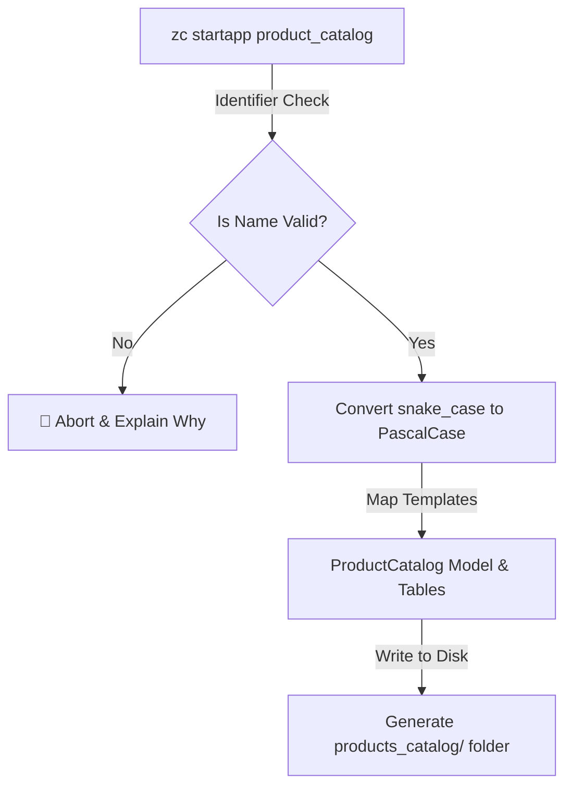

# 🛠️ Command-Line Scaffolding Tool (CLI)

The `zc` command-line utility is a modest but practical tool designed to help you maintain a consistent project structure. It automates the repetitive task of creating files and folders, ensuring that every module in your system follows the same architectural blueprint.

---

## 📋 Core Scaffolding Commands

The `zc` CLI supports four primary operations to help you move from an idea to a running service in minutes.

| Command | Usage | Resulting Files | Purpose |
| :--- | :--- | :--- | :--- |
| ✨ **`init`** | `zc init <name>` | `main.py`, `.env`, `requirements.txt` | Initializes a new project root. |
| 🚀 **`startapp`** | `zc startapp <name>` | `models.py`, `services.py`, `plugin.py`, etc. | Scaffolds a modular domain plugin. |
| 🔥 **`run`** | `zc run` | *(Uvicorn Process)* | Launches the local development server. |
| 🔑 **`gensecret`** | `zc gensecret` | `64-char-hex-string` | Generates a secure `SECRET_KEY`. |

---

## 📐 Scaffolding Architecture

The CLI is engineered to prevent common naming mistakes. It ensures that your files are valid Python modules and your database tables follow clean `snake_case` naming conventions.



### 🛡️ Guardrails for Consistency
Before creating any files, the CLI verifies your input against Python's naming rules. This prevents issues where an app name might conflict with Python keywords or contain invalid characters.

---

## 📝 Scaffolding Options

ZCore offers two ways to generate your application modules depending on how much control you want from the start:

1.  **Clean Slate:** Running `zc startapp products` creates the necessary files but keeps them empty, allowing you to define your logic from a blank canvas.
2.  **Guided Template:** Running `zc startapp products -t` (or `--template`) pre-populates the files with working ZCore boilerplates. This includes a sample Model, Schema, Repository, Service, and Router already wired together.

---

## 💻 Practical Usage Guide

### 1. Initialize a Project
When you run `init`, ZCore automatically generates a `.env` file pre-configured with a unique, cryptographically secure secret key.

```bash
zc init my_new_api
cd my_new_api
```

### 2. Scaffold a New Domain App
We recommend using the `-t` flag for your first few modules to see how the layers are intended to interact.

```bash
# Generates a structured module with boilerplate code
zc startapp order_management -t
```

### 3. Launch the Development Server
The `run` command is a modest wrapper around Uvicorn. It automatically looks for your `.env` file to set the correct host and port.

```bash
zc run
```

---

## 💡 Engineering Insights

!!! tip "💡 Why use the CLI?"
    Consistency is the key to maintainability. By using the CLI, you ensure that every developer on your team starts with the same file names and the same structural patterns, making it much easier to navigate the codebase as it grows.

!!! info "🔑 Secret Key Generation"
    The `gensecret` command uses Python's standard `secrets` module to generate a 256-bit token. You should use this to replace the default `SECRET_KEY` in your production environment to ensure your JWT tokens are securely signed.

!!! warning "🛡️ Valid Identifiers"
    If you try to name an app `123-app` or `my app`, the CLI will block the operation. Python modules must start with a letter and contain only alphanumeric characters or underscores.
