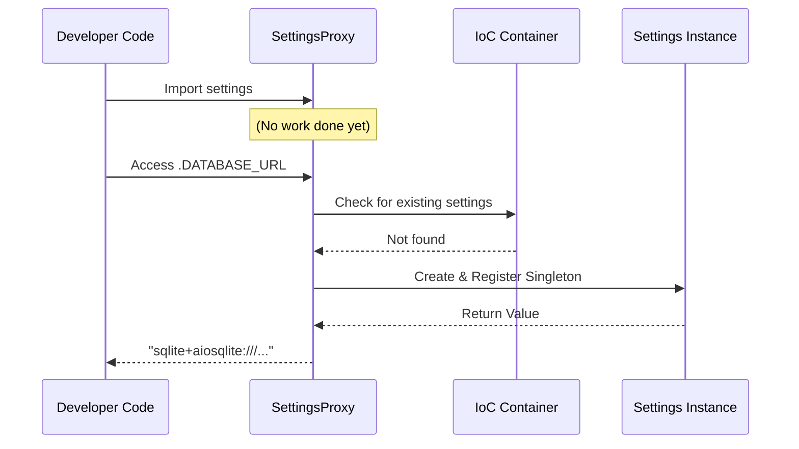

# ⚙️ Configuration Management

ZCore manages application settings using a modest and practical approach based on **Pydantic Settings (v2)**. This ensures that your configurations are validated, type-safe, and driven by environment variables, while remaining easy to manage as your project grows.

---

## 📋 Configuration Schema (`ZCoreCoreSettings`)

Core settings are defined in a central schema. This class automatically parses, validates, and converts values from your system's environment variables or a `.env` file at runtime.

| Variable | Default Value | Purpose |
| :--- | :--- | :--- |
| 🌍 `ENVIRONMENT` | `"production"` | Context: `production`, `development`, or `test`. |
| 📛 `PROJECT_NAME` | `"ZCore App"` | Branding used in OpenAPI/Swagger metadata. |
| 🗄️ `DATABASE_URL` | `sqlite+aiosqlite...` | Primary SQL connection string. |
| 🧪 `DATABASE_TEST` | `sqlite+aiosqlite...` | Isolated database used during automated tests. |
| 🏊 `POOL_SIZE` | `5` | Connection pool size (bypassed for SQLite). |
| 🔑 `SECRET_KEY` | *(Insecure Fallback)* | Cryptographic key for signing JWTs and hashes. |
| ⏳ `ACCESS_TOKEN...` | `30` | Access token lifespan in minutes. |
| 📁 `STORAGE_PATH` | `"./storage"` | Local directory reserved for file uploads. |
| 🛰️ `REDIS_URL` | `None` | Redis connection URI (if caching is active). |

---

## 📂 Environmental File Loading

The configuration manager looks for a `.env` file in your project root by default. You can easily switch between different configuration files (e.g., for testing) by setting the `ENV_FILE` environment variable.

```bash
# Example: Run tests using a specific test environment file
ENV_FILE=.env.test pytest tests/
```

---

## 🧠 Lazy Resolution via `SettingsProxy`

A common issue in large applications is "circular imports" or slow startups caused by loading configurations too early. ZCore solves this through a **Lazy-Resolution Proxy**.



!!! info "🛡️ Engineered for Efficiency"
    The `settings` object you import is actually a "Proxy." It remains dormant until you access an attribute for the first time. At that moment, it communicates with the **IoC Container** to instantiate the settings as a global singleton.

---

## 💻 Practical Usage

We suggest importing the global `settings` proxy to access your configurations anywhere in your application.

```python
from zcore.config import settings

# Safe, lazy access to your environment variables
db_url = settings.DATABASE_URL
is_dev = settings.ENVIRONMENT == "development"
```

### 🛠️ Overriding Settings for Testing
If you need to change settings dynamically (for example, using an in-memory database during unit tests), you can register a custom subclass in the IoC container before the application boots:

```python
from zcore.config import ZCoreCoreSettings, initialize_settings

class TestSettings(ZCoreCoreSettings):
    DATABASE_URL: str = "sqlite+aiosqlite:///:memory:"
    ENVIRONMENT: str = "test"

# Register this as the global settings instance
initialize_settings(TestSettings())
```

---

## 💡 Engineering Insights

!!! tip "💡 Type Safety"
    Because ZCore uses Pydantic, your settings are strictly typed. If you define `POOL_SIZE: int` but provide `"abc"` in your `.env` file, ZCore will raise a clear validation error during startup, preventing your app from running in an unstable state.

!!! warning "🛡️ Production Security"
    In a production environment, never rely on the default `SECRET_KEY`. ZCore will log a warning (or abort in strict mode) if it detects the insecure fallback key is active. Use `zc gensecret` to create a strong, unique key for your deployment.

!!! info "🧪 Extra Variables"
    The `ZCoreCoreSettings` class is configured to ignore "extra" variables in your `.env` file. This allows you to keep other configuration data in the same file without causing Pydantic validation errors.
