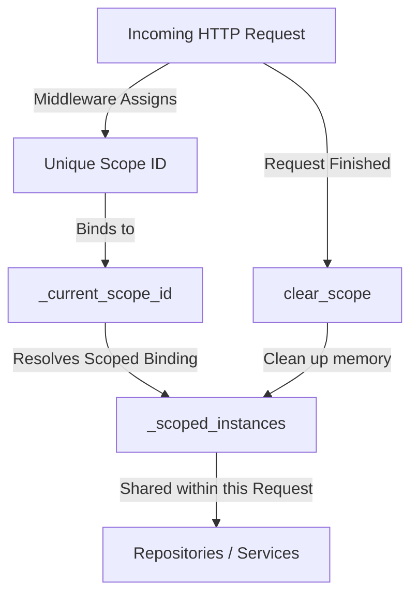

# 💉 Dependency Injection (IoC Container)

Dependency Injection (DI) is a modest but powerful pattern that allows your application to remain decoupled and easy to test. Instead of a class creating its own "helpers," the framework "injects" them. ZCore’s built-in Inversion of Control (IoC) container manages these dependencies for you, handling everything from simple utilities to complex database sessions.

---

## ⏳ Lifecycle Management

The ZCore `IoCContainer` manages objects across three practical lifecycles. Choosing the right lifecycle ensures your application uses memory efficiently and keeps data isolated where necessary.

| Lifecycle | Scope | Practical Use Case |
| :--- | :--- | :--- |
| 🌍 **Singleton** | Shared globally across the entire application. | Event dispatchers, config managers, database engines. |
| 🔄 **Scoped** | Created once per HTTP request and then destroyed. | Database sessions, current user context, repositories. |
| ✨ **Transient** | A fresh instance is created every time it's requested. | Calculation helpers, data formatters, short-lived tasks. |

---

## 📐 Technical Architecture & Isolation

One of the most important jobs of a DI container in a web framework is ensuring that **User A's data never leaks into User B's request**. ZCore uses "Context Variables" (`contextvars`) to create a thread-safe sandbox for every request.



*   **`_current_scope_id`**: A tracking ID for the active request.
*   **`_scoped_instances`**: A private dictionary for the current request. When the request ends, ZCore modestly clears this dictionary to prevent memory pollution.

---

## 🧠 High-Performance Reflection Caching

Inspecting Python code at runtime (Reflection) can be slow. To ensure ZCore remains responsive, the auto-wiring engine uses a two-stage caching strategy:

1.  **Constructor Caching**: We cache the `__init__` method of your classes so we don't have to look them up repeatedly.
2.  **Signature Caching**: We resolve type hints (like `repository: ProductRepository`) once and store them. Subsequent requests skip the "discovery" phase and jump straight to "instantiation."

---

## 🛡️ Safety: Circular Dependency Detection

In complex systems, it's easy to accidentally create a loop (e.g., `ServiceA` needs `ServiceB`, but `ServiceB` needs `ServiceA`). Without protection, this would cause the application to crash or freeze.

ZCore implements a recursive tracking stack. If it detects that it is trying to resolve the same class twice in a single "branch" of the dependency tree, it raises a `CircularDependencyError` with a clear map of the loop:

```text
❌ CircularDependencyError: Circular dependency detected: 
   ServiceA -> ServiceB -> ServiceA
```

---

## 💻 Practical Usage

### 1. Registering Custom Lifecycles
You can manually register bindings in your `plugin.py` or during application startup.

```python
from zcore.kernel.di import container

# Register a globally shared Singleton
container.register_singleton(PaymentGateway, MockPaymentGateway())

# Register a Scoped implementation (Shared within one request)
container.register_scoped(IUserRepository, SQLUserRepository)
```

### 2. Injecting Dependencies
We suggest using the `Inject` helper. It works seamlessly in both class constructors and FastAPI route handlers.

```python
from zcore.kernel.di import Inject
from products.repositories import ProductRepository

class ProductService:
    # ZCore will automatically provide the 'repository' instance
    def __init__(self, repository: ProductRepository = Inject(ProductRepository)):
        self.repository = repository
```

---

## 💡 Engineering Insights

!!! tip "💡 Why use DI?"
    DI makes your code **Testable**. In your real app, you inject a `PostgresRepository`. In your tests, you can inject a `MockRepository` without changing a single line of your `ProductService` logic.

!!! info "🛡️ FastAPI Integration"
    The `Inject` function is designed to be compatible with FastAPI's `Depends`. This means ZCore's DI and FastAPI's DI work together as one unified system.

!!! warning "🧹 Scoped Cleanup"
    Scoped dependencies are only as good as their cleanup. ZCore's `ScopedDependencyMiddleware` handles this automatically. If you are using the DI container outside of the web layer (e.g., in a background script), remember to manually manage your scope boundaries.
