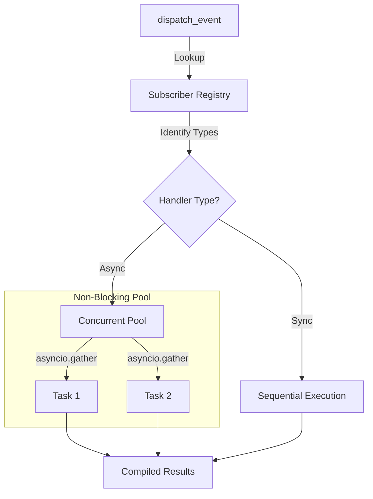

# 🔔 Kernel Events System

ZCore provides a modest and practical event system managed by the `EventDispatcher`. It enables "decoupled communication," which is a fancy way of saying it allows different parts of your application to talk to each other without being directly connected. This makes your code easier to maintain and extend.

---

## 🏗️ The Event Dispatcher

The central `EventDispatcher` acts as a "switchboard." It keeps track of who is interested in certain events and notifies them when those events occur. It is registered as a global singleton, so you can access it from anywhere in your application.

### 📋 Core Methods

| Method | Purpose |
| :--- | :--- |
| 📥 `subscribe` | Registers a function (listener) to wait for a specific event key. |
| 📤 `dispatch` | Triggers an event and executes all registered listeners. |
| 🔌 `unsubscribe` | Removes a listener so it no longer receives updates. |

---

## 🚀 Asynchronous Concurrent Execution

When you trigger an event, ZCore doesn't just run the listeners one by one in a slow line. It intelligently analyzes each listener:

1.  **Synchronous Handlers:** Executed immediately in order.
2.  **Asynchronous Handlers:** Grouped together and executed **concurrently** (at the same time) using `asyncio.gather`. This ensures that one slow task (like sending an email) doesn't block the rest of your application.



---

## 🛡️ Fault Tolerance & Isolation

A critical part of ZCore's engineering is **Fault Isolation**. In a modest system, if one "listener" fails (e.g., a notification service is down), it should not crash the entire process or prevent other listeners from working.

ZCore uses a "Safe-Execute" pattern. Every listener is isolated so that errors are caught and logged without stopping the dispatcher:

```python
# Internal safety mechanism
results = await asyncio.gather(*async_tasks, return_exceptions=True)
for res in results:
    if isinstance(res, Exception):
        # The error is logged, but execution continues
        logger.error(f"Event listener failed: {res}")
```

| Feature | Behavior | Benefit |
| :--- | :--- | :--- |
| **Error Trapping** | Caught via `return_exceptions=True`. | One failing task won't crash the others. |
| **Traceback Logging** | Full context recorded in logs. | Easy to debug without stopping production. |
| **Result Aggregation** | Returns results from all successful tasks. | Predictable feedback for the dispatcher. |

---

## 💻 Practical Usage

### 1. Subscribing to an Event
We suggest registering your event listeners inside your plugin's `on_startup` hook. This ensures they are ready as soon as the server starts.

```python
from zcore.kernel import Plugin
from zcore.kernel.events import EventDispatcher
from zcore.kernel.di import Inject

async def send_welcome_email(user_id: str) -> None:
    # Logic to send email...
    print(f"📧 Welcome email sent to {user_id}")

class NotificationPlugin(Plugin):
    name = "notifier"
    
    async def on_startup(self) -> None:
        # Resolve dispatcher via DI and subscribe
        dispatcher = Inject(EventDispatcher)()
        dispatcher.subscribe("user.registered", send_welcome_email)
```

### 2. Dispatching an Event
You can trigger an event from any service or repository.

```python
from zcore.kernel.events import EventDispatcher
from zcore.kernel.di import Inject

async def register_user(user_data):
    # ... logic to save user ...
    
    # Notify the system that a user was registered
    dispatcher = Inject(EventDispatcher)()
    await dispatcher.dispatch("user.registered", user_id="user_123")
```

---

## 💡 Engineering Insights

!!! tip "💡 Non-Blocking by Design"
    Since events are often used for "side-effects" (like logging or analytics), ZCore ensures they are non-blocking. Your main business logic continues to run while the event listeners work in the background.

!!! info "🛡️ Clean Unsubscription"
    Always remember to `unsubscribe` if you are creating dynamic listeners that aren't tied to the global application lifecycle. For standard plugins, ZCore manages most of this for you.

!!! warning "🧹 Payload Consistency"
    The dispatcher forwards all arguments (`*args`, `**kwargs`) to the listeners. Make sure your listener functions accept exactly the same parameters that the dispatcher sends to avoid `TypeError` errors.
