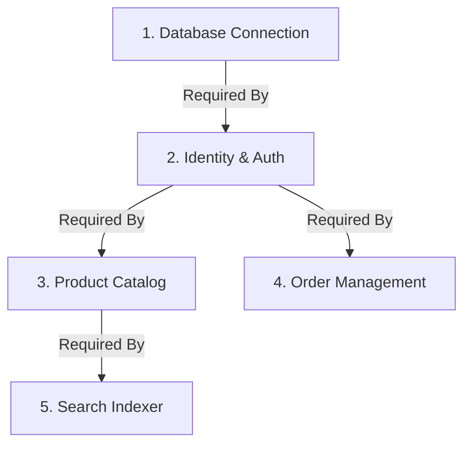
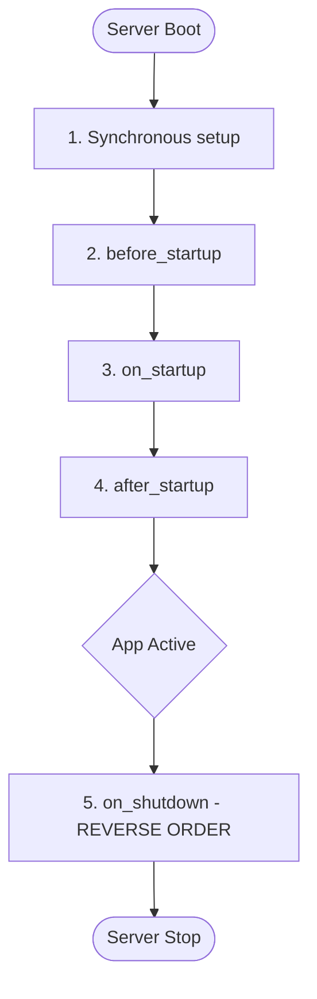

# 🧠 Framework Engine & Plugin Protocol

The ZCore `Kernel` is the modest orchestration engine at the heart of every application. It views your software not as a single block of code, but as a collection of self-contained **Plugins**. The Kernel's primary job is to coordinate these plugins, ensuring they are configured correctly and initialized in the exact order their dependencies require.

---

## 📜 The Plugin Contract (Protocol)

In ZCore, a "Plugin" is any module that follows a specific set of rules (a Protocol). This structure ensures that whether you are building a simple logger or a complex payment system, the framework knows exactly how to talk to your code.

| Method | Timing | Practical Use Case |
| :--- | :--- | :--- |
| 🛠️ `setup(app)` | **Immediate** | Registering routes and binding DI singletons. |
| 🏁 `before_startup` | **Pre-flight** | Verifying environment variables or file permissions. |
| 🔥 `on_startup` | **Bootstrapping** | Opening database pools or warming up caches. |
| ✨ `after_startup` | **Post-launch** | Triggering health checks or background workers. |
| 🛑 `on_shutdown` | **Cleanup** | Safely closing connections and flushing buffers. |

---

## 📐 Topological Dependency Resolution

One of the most practical features of the Kernel is how it handles dependencies. If your `AnalyticsPlugin` needs the `DatabasePlugin` to be ready first, you simply declare it. 

The Kernel uses a mathematical approach called **Topological Sorting** to build a Directed Acyclic Graph (DAG). This ensures that no matter how many plugins you have, they always start in a sequence where every "parent" is ready before the "child" begins.

### 🛡️ Built-in Engineering Safeguards:
1.  **Cyclic Detection:** If Plugin A depends on B, and B depends on A, the Kernel will detect this "infinite loop" and abort startup with a clear error message.
2.  **Missing Requirements:** If a plugin asks for a dependency that isn't registered, the Kernel stops immediately, preventing "partial" system failures that are hard to debug.

---

## 🔄 The Lifespan Sequence

The Kernel manages the application lifecycle through a FastAPI context manager. It ensures that startup happens in **forward order** (following dependencies), but shutdown happens in **reverse order** to release resources safely.

---

## 💡 Engineering Insights

!!! tip "💡 Safe Resource Teardown"
    By running `on_shutdown` in reverse order, ZCore ensures that the `DatabasePlugin` is the **last** thing to close. This allows other plugins to finish their final database writes before the connection pool is destroyed.

!!! info "🛡️ Error Resilience"
    ZCore follows a **Fail-Fast** philosophy. If any plugin fails during its `on_startup` phase, the Kernel aborts the entire sequence and shuts down the server. This prevents your application from running in a "half-broken" state where some features work and others don't.

!!! note "🧠 Why a Protocol?"
    ZCore uses `typing.Protocol` instead of standard inheritance for plugins. This means your class doesn't *have* to inherit from anything to be a plugin; it just needs to have the right methods. This keeps your code clean and reduces "framework coupling."
