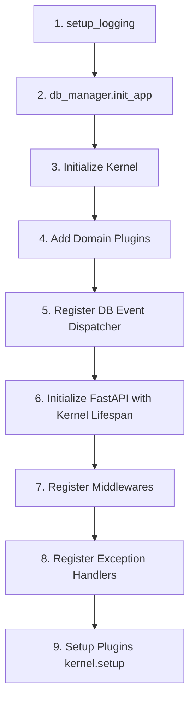

# 🚀 Application Bootstrapping

Bootstrapping is the modest but crucial process of assembling your application's components into a single, running unit. In ZCore, this happens in `main.py`. It is the "meeting place" where logging, database connections, security layers, and your domain plugins are wired together.

---

## 📐 The Assembly Sequence

A predictable startup sequence is essential for system stability. ZCore follows a strict order of operations to ensure that each layer is ready before the next one relies on it.



---

## 🛠️ Bootstrapping Reference Table

| Step | Component | Practical Purpose |
| :--- | :--- | :--- |
| **1** | **Logging** | Standardizes diagnostics so logs are readable by both humans and machines. |
| **2** | **Database** | Prepares the async connection pool and sets performance boundaries. |
| **3 & 4** | **Kernel** | Registers your domain modules and calculates their startup order. |
| **5** | **DB Bridge** | Allows database transactions to communicate with the rest of the system. |
| **6** | **FastAPI** | Creates the web engine and binds it to the Kernel’s lifecycle hooks. |
| **7** | **Middlewares** | Sets up request tracing and ensures isolated dependency sandboxes. |
| **8** | **Error Handling** | Standardizes how failures are communicated back to the client. |
| **9** | **Setup** | Finalizes the wiring (e.g., registering routes for every plugin). |

---

## 💻 Complete Assembly Guide (`main.py`)

We suggest the following structured layout for your entry point to ensure all ZCore features are fully utilized:

```python
import sys
from pathlib import Path
sys.path.insert(0, str(Path(__file__).resolve().parent))

from fastapi import FastAPI
from zcore import Kernel, settings
from zcore.web import RequestLogMiddleware, ScopedDependencyMiddleware
from zcore.exceptions import app_exception_handler, AppException
from zcore.db import db_manager, register_db_event_dispatcher
from zcore.logging import setup_logging

# Import your custom modular plugins
from products.plugin import ProductPlugin
from billing.plugin import BillingPlugin

# 1. Initialize Structured Logging
# Standardizes logs into a consistent format (Console or JSON).
setup_logging()

# 2. Configure the Database Manager
# Tunes the async connection pool according to your .env settings.
db_manager.init_app(
    db_url=settings.DATABASE_URL,
    pool_size=settings.POOL_SIZE,
    max_overflow=settings.MAX_OVERFLOW,
    echo=(settings.ENVIRONMENT == "development")
)

# 3. Create the Core Kernel
kernel = Kernel()

# 4. Register Modular Domain Plugins
# The Kernel will automatically sort these based on their dependencies.
kernel.add_plugin(ProductPlugin())
kernel.add_plugin(BillingPlugin())

# 5. Register the Global Database Event Dispatcher
# Enables "Post-Commit" events across your repositories and services.
register_db_event_dispatcher(kernel.dispatcher)

# 6. Initialize FastAPI and Hook the Kernel Lifespan
# This connects ZCore's lifecycle hooks (on_startup, etc.) to the web server.
app = FastAPI(
    title=settings.PROJECT_NAME,
    lifespan=kernel.lifespan
)

# 7. Apply Core Architectural Middlewares
# Handles Request Correlation IDs and Scoped DI cleanup.
app.add_middleware(RequestLogMiddleware)
app.add_middleware(ScopedDependencyMiddleware)

# 8. Apply the Centralized Exception Handler
# Ensures business failures are returned as clean, standardized JSON.
app.add_exception_handler(AppException, app_exception_handler)

# 9. Finalize Plugin Setup
# Triggers each plugin's setup() hook to register its routes and routers.
kernel.setup(app)

@app.get("/health")
async def health():
    return {
        "status": "healthy",
        "framework": "ZCore",
        "environment": settings.ENVIRONMENT
    }
```

---

## 💡 Engineering Insights

!!! tip "💡 Debugging SQL Queries"
    By setting `echo=(settings.ENVIRONMENT == "development")`, SQLAlchemy will print every compiled SQL statement to your terminal. This is a practical way to detect "N+1 query" problems early in development.

!!! info "🛡️ Middleware Order"
    The order of `app.add_middleware` is important. The `RequestLogMiddleware` is registered first so it can generate a unique `request_id` that all other middlewares and services can use for logging.

!!! note "🧠 Minimalist Main"
    A well-engineered `main.py` should be mostly declarative. Its job is to "register" and "configure," not to contain actual business logic. If this file grows too large, consider moving configuration logic into separate plugins.
