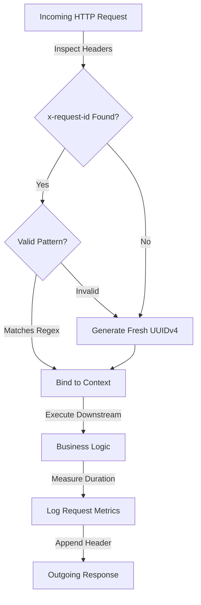

# 🛡️ ASGI Web Middlewares

ZCore provides two modest but essential ASGI middlewares that coordinate the lifecycle of every HTTP request. Their primary job is to ensure that requests are traceable, logs are structured, and dependencies remain safely isolated in their own "sandboxes."

---

## 1. Request Tracking & Traceability (`RequestLogMiddleware`)

The `RequestLogMiddleware` is the first point of contact for an incoming request. It manages "Correlation IDs" and binds metrics to your logs so you can trace exactly what happened during a specific transaction.

### 📐 Execution Flow
This diagram illustrates how the middleware handles the identity and timing of a request:



### 🛡️ Modest Security Precautions
To prevent "Log Injection" attacks where a malicious client sends a carefully crafted header to corrupt your logs, ZCore enforces a strict character pattern. Only alphanumeric characters and a few safe symbols are allowed:

```python
# Modest regex safety check
REQUEST_ID_PATTERN = re.compile(r"^[a-zA-Z0-9\-\.\_\:]{8,64}$")
```

### 🪵 Structured Logging Context
Once a valid ID is resolved, it is bound to the `structlog` context variables. This means every log entry generated during that request—whether it's from a service, a repository, or a plugin—will automatically include the `request_id`, making debugging significantly easier.

---

## 2. Dependency Isolation (`ScopedDependencyMiddleware`)

The `ScopedDependencyMiddleware` is responsible for creating and destroying the "Request Sandbox." It ensures that dependencies like database sessions are isolated to a single request and are safely released when the request ends.

### 📦 The Request Sandbox Lifecycle
This middleware coordinates with the **IoC Container** to manage the `Scoped` lifecycle.

| Phase | Action | Why it Matters |
| :--- | :--- | :--- |
| 🏁 **Request Entry** | Generate a unique `scope_id`. | Identifies the unique "sandbox" for this specific request. |
| 💉 **Initialization** | Bind `scope_id` to `contextvars`. | Tells the DI container where to store newly created objects. |
| 🚦 **Execution** | Run the application logic. | Any `Scoped` dependency (like a DB session) is shared only within this request. |
| 🧹 **Teardown** | `container.clear_scope()` | **Critical:** Safely closes and purges all objects created during the request. |

### 🛠️ Practical Implementation
ZCore handles this automatically in the background. Here is a modest look at the internal cleanup logic:

```python
try:
    # Process the request
    await self.app(scope, receive, send)
finally:
    # Guarantee cleanup even if an error occurred
    container.clear_scope(scope_id)
```

---

## 💡 Engineering Insights

!!! tip "💡 Observability Tip"
    If your system interacts with other microservices, ensure they also forward the `x-request-id` header. This allows ZCore to link its logs with the logs of other systems, providing a complete "Distributed Trace" of a user's journey.

!!! warning "🛡️ Middleware Order"
    In your `main.py`, always register `RequestLogMiddleware` **before** other middlewares. This ensures that the `request_id` is available for all subsequent layers, including the `ScopedDependencyMiddleware`.

!!! info "🛡️ Preventing Memory Leaks"
    The `ScopedDependencyMiddleware` is your primary defense against memory leaks. By calling `clear_scope` in a `finally` block, ZCore ensures that database connections are returned to the pool and memory is released even if the application crashes during a request.
