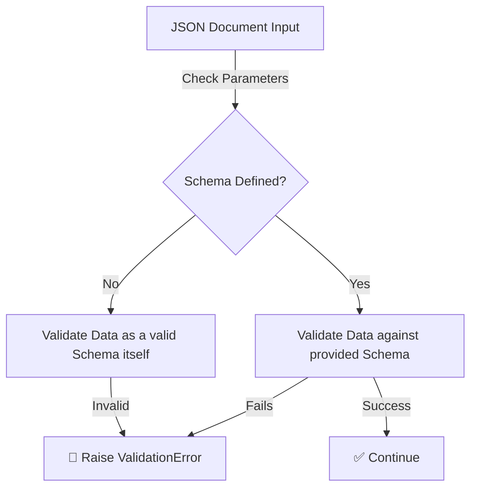

# 🛠️ System Utilities

ZCore provides a modest and practical set of system utilities to handle the "small but important" tasks that every application needs. These tools ensure that operations like JSON serialization, data validation, and text transformation are handled consistently across all your modules.

---

## 1. Advanced JSON Serialization (`CustomJSONEncoder`)

Standard Python JSON libraries often struggle with common data types like `Decimal`, `UUID`, and `datetime`. ZCore solves this by extending the default encoder to support these types out of the box, preventing unexpected `TypeError` errors when returning data.

| Data Type | Target Format | Implementation Strategy |
| :--- | :--- | :--- |
| 🆔 **`uuid.UUID`** | `str` (String) | Converted via `str(obj)`. |
| 📅 **`datetime / date / time`** | `str` (ISO-8601) | Converted via `obj.isoformat()`. |
| 💰 **`Decimal`** | `float` (Float) | Cast via `float(obj)` for JSON compatibility. |

### 💻 Practical Usage
We suggest using ZCore's `json_dumps` and `json_loads` wrappers instead of the standard library to ensure these rules are always applied.

```python
import uuid
from decimal import Decimal
from zcore.utils.helpers import json_dumps

payload = {
    "id": uuid.uuid4(),
    "amount": Decimal("150.75"),
    "status": "active"
}

# Safely serialize to a JSON string without errors
json_str = json_dumps(payload)
```

---

## 2. Dynamic JSON Schema Validation (`validate_json_schema`)

This utility allows you to validate raw JSON structures against **Draft-7** standards. It is particularly useful when handling dynamic data that isn't captured by your fixed Pydantic models.



### 📋 Two Modes of Operation:
1.  **Data Validation:** Checks if a piece of data (like a configuration file or a dynamic form submission) matches your rules.
2.  **Schema Verification:** If you are building a tool that *generates* schemas, call this function with only the schema. It will verify that your schema is structurally sound and follows Draft-7 rules.

---

## 3. URL-Safe Slug Generation (`slugify`)

The `slugify` utility is a modest tool that transforms human-readable text into "URL-safe" strings. This is ideal for generating clean URLs from titles or names.

### 📐 Transformation Logic:
*   Converts all text to **lowercase**.
*   Removes special characters and symbols.
*   Replaces spaces and underscores with a **single hyphen**.
*   Trims leading and trailing hyphens.

| Input String | Resulting Slug |
| :--- | :--- |
| `My Awesome Product!` | `my-awesome-product` |
| `Laptop _ SKU-123` | `laptop-sku-123` |
| `---Clean Me---` | `clean-me` |

---

## 💡 Engineering Insights

!!! tip "💡 Why use Decimals in JSON?"
    While JSON doesn't have a native "Decimal" type, ZCore converts them to floats during serialization. This is a practical compromise for web communication. However, always remember that for financial calculations *inside* your Python code, you should keep them as `Decimal` objects to preserve precision.

!!! info "🛡️ Error Context"
    When `validate_json_schema` fails, it doesn't just say "No." It returns a structured `ValidationError` containing the exact `path` to the problematic field and the specific `schema` rule that was violated, making it much easier for your API clients to fix their request.

!!! warning "🧹 Slug Sanitization"
    The `slugify` tool uses regular expressions to strip unsafe characters. It is designed for URL paths and filenames. While it is robust, always ensure you handle potential collisions (e.g., two products named "Widget") by appending a unique ID or hash if necessary.
