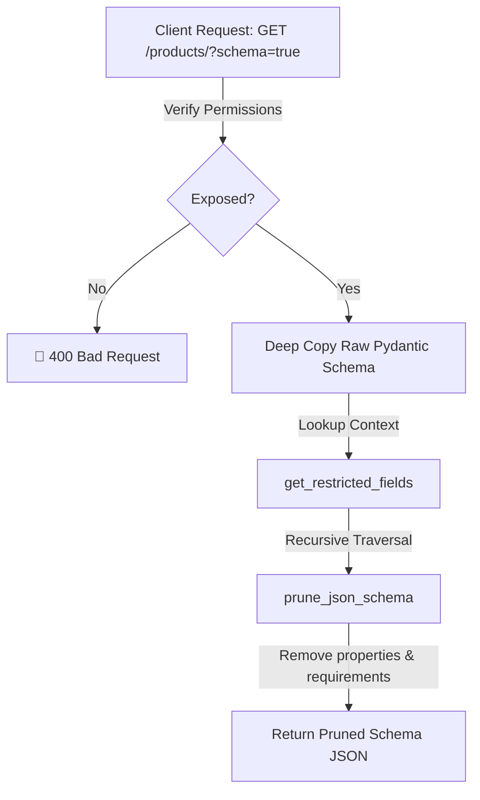

# 🚦 API Routing & Dynamic Schema Pruning

ZCore extends FastAPI's routing capabilities through a modest but powerful subclass called `ZCoreAPIRoute`. This specialized route handler acts as an intelligent "gatekeeper," managing how data structures are exposed to the outside world and ensuring that security policies are enforced even at the metadata level.

---

## 🔍 Dynamic Schema Pruning (`?schema=true`)

A practical challenge in modern web development is keeping the frontend in sync with backend validation rules. ZCore allows clients to query an endpoint's structure by appending `?schema=true` to any supported URL.

However, exposing raw schemas can be a security risk if they reveal "Restricted Fields." ZCore solves this by dynamically "pruning" the JSON Schema in real-time before it ever leaves the server.

### 📐 The Pruning Pipeline



### 🧠 Recursive Pruning Logic
The `prune_json_schema` utility doesn't just look at the top level; it recursively walks through the entire JSON Schema tree. It is engineered to handle complex structures, including:
*   **Nested Objects:** Removing fields deep within the hierarchy.
*   **Requirements:** Automatically removing a field from the `required` list if it is pruned from `properties`.
*   **References (`$ref`):** Safely following JSON pointers to prune shared definitions across your models.

---

## 🛡️ Cache Safety (The `Vary` Header)

When an API response is "tailored" (pruned) for a specific user's permissions, intermediate caches—like **Cloudflare**, **Nginx**, or even a browser—can become a liability. They might cache a "restricted" version of a product and serve it to an admin, or vice versa.

To prevent this data leakage, `ZCoreAPIRoute` automatically manages the `Vary` HTTP header.

| Header Element | Why ZCore adds it |
| :--- | :--- |
| **`Authorization`** | Tells proxies the content changes based on the user's token. |
| **`Cookie`** | Ensures session-based differences are respected by the cache. |

```python
# Internal logic: protecting the cache boundary
if hidden_fields:
    response.headers["Vary"] = "Authorization, Cookie"
```

!!! info "🛡️ Engineered for Privacy"
    By signaling the `Vary` header, ZCore ensures that your infrastructure (CDNs and Proxies) understands that the "same" URL can yield different data depending on who is asking.

---

## 🛠️ Schema Resolution Helpers

To make schema exposure work automatically, ZCore uses internal "discovery" helpers. These allow the framework to find your Pydantic models even when they are wrapped in complex generic types like `List[ProductResponse]` or `Optional[UserResponse]`.

| Helper | Responsibility |
| :--- | :--- |
| **`find_input_schema`** | Locates the `BaseModel` used in the request body (for POST/PUT). |
| **`find_output_schema`** | Traverses generic containers to find the core "Response" model. |

---

## 💡 Engineering Insights

!!! tip "💡 Beyond Metadata"
    The `ZCoreAPIRoute` isn't just about schemas. It also forces the route to use `ZCoreJSONResponse`. This custom response class is what actually executes the field pruning on your **real data** before it is serialized into JSON.

!!! warning "🛡️ Performance Note"
    Schema pruning involves deep-copying and recursive traversal of dictionary trees. While highly optimized, ZCore only performs this work when a client explicitly requests `?schema=true`. Standard API calls bypass the schema pruning logic to maintain high performance.

!!! note "🧠 Automatic Integration"
    When you use `BaseRouter`, all these features are enabled by default. You don't need to manually configure `APIRoute` classes; the framework orchestrates the wiring for you.
