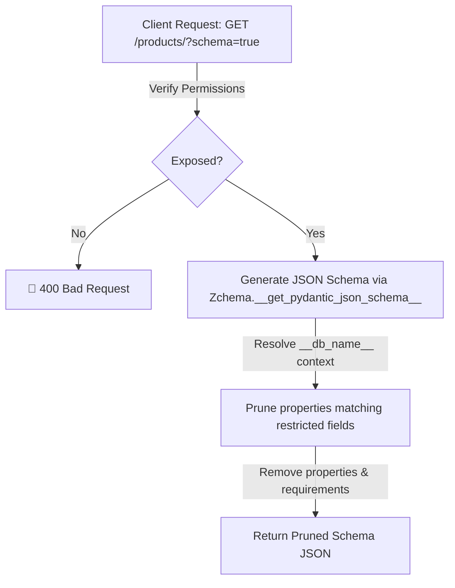

# 🚦 API Routing & Dynamic Schema Pruning

ZCore extends FastAPI's routing capabilities through a modest but powerful subclass called `ZCoreAPIRoute`. This specialized route handler acts as an intelligent "gatekeeper," managing how data structures are exposed to the outside world and ensuring that security policies are enforced even at the metadata level.

---

## 🔍 Dynamic Schema Pruning (`?schema=true`)

A practical challenge in modern web development is keeping the frontend in sync with backend validation rules. ZCore allows clients to query an endpoint's structure by appending `?schema=true` to any supported URL.

However, exposing raw schemas can be a security risk if they reveal restricted fields. ZCore solves this by leveraging the `Zchema` base class, which automatically prunes the JSON Schema during generation — before it ever leaves the server.

### 📐 The Pruning Pipeline



### 🧠 How It Works

When `?schema=true` is requested, `ZCoreAPIRoute` calls `model_json_schema()` on the target schema. Because the schema inherits from `Zchema`, the `__get_pydantic_json_schema__` hook is triggered automatically. This hook:

1. Resolves the active context's restricted fields via `get_restricted_fields()`
2. Filters the paths to only those matching the schema's `__db_name__`
3. Recursively prunes matching properties from the JSON Schema tree
4. Removes pruned fields from the `required` list

This means no deep-copy or manual `prune_json_schema` calls are needed — the pruning is handled natively by Pydantic V2's schema generation pipeline.

---

## 🛡️ Cache Safety (The `Vary` Header)

When an API response is "tailored" (pruned) for a specific user's permissions, intermediate caches—like **Cloudflare**, **Nginx**, or even a browser—can become a liability. They might cache a "restricted" version of a product and serve it to an admin, or vice versa.

To prevent this data leakage, `ZCoreAPIRoute` automatically manages the `Vary` HTTP header.

| Header Element | Why ZCore adds it |
| :--- | :--- |
| **`Authorization`** | Tells proxies the content changes based on the user's token. |
| **`Cookie`** | Ensures session-based differences are respected by the cache. |

```python
# Internal logic: protecting the cache boundary
if hidden_fields:
    response.headers["Vary"] = "Authorization, Cookie"
```

!!! info "🛡️ Engineered for Privacy"
    By signaling the `Vary` header, ZCore ensures that your infrastructure (CDNs and Proxies) understands that the "same" URL can yield different data depending on who is asking.

---

## 🛠️ Schema Resolution Helpers

To make schema exposure work automatically, ZCore uses internal "discovery" helpers. These allow the framework to find your Pydantic models even when they are wrapped in complex generic types like `List[ProductResponse]` or `Optional[UserResponse]`.

| Helper | Responsibility |
| :--- | :--- |
| **`find_input_schema`** | Locates the `Zchema`/`BaseModel` used in the request body (for POST/PUT). |
| **`find_output_schema`** | Traverses generic containers to find the core "Response" model. |

---

## 💡 Engineering Insights

!!! tip "💡 Pruning Is Native Now"
    Previously, ZCore used a `prune_json_schema` utility that deep-copied and manually traversed dictionary trees. With `Zchema`, the pruning is handled by Pydantic V2's native `__get_pydantic_json_schema__` hook — no deep-copying, no manual recursion, and full compatibility with the Pydantic ecosystem.

!!! warning "🛡️ Performance Note"
    Schema pruning via `Zchema` is highly optimized and only performed when a client explicitly requests `?schema=true`. Standard API calls bypass the schema pruning logic to maintain high throughput.

!!! note "🧠 Automatic Integration"
    When you use `BaseRouter`, all these features are enabled by default. You don't need to manually configure `APIRoute` classes; the framework orchestrates the wiring for you.