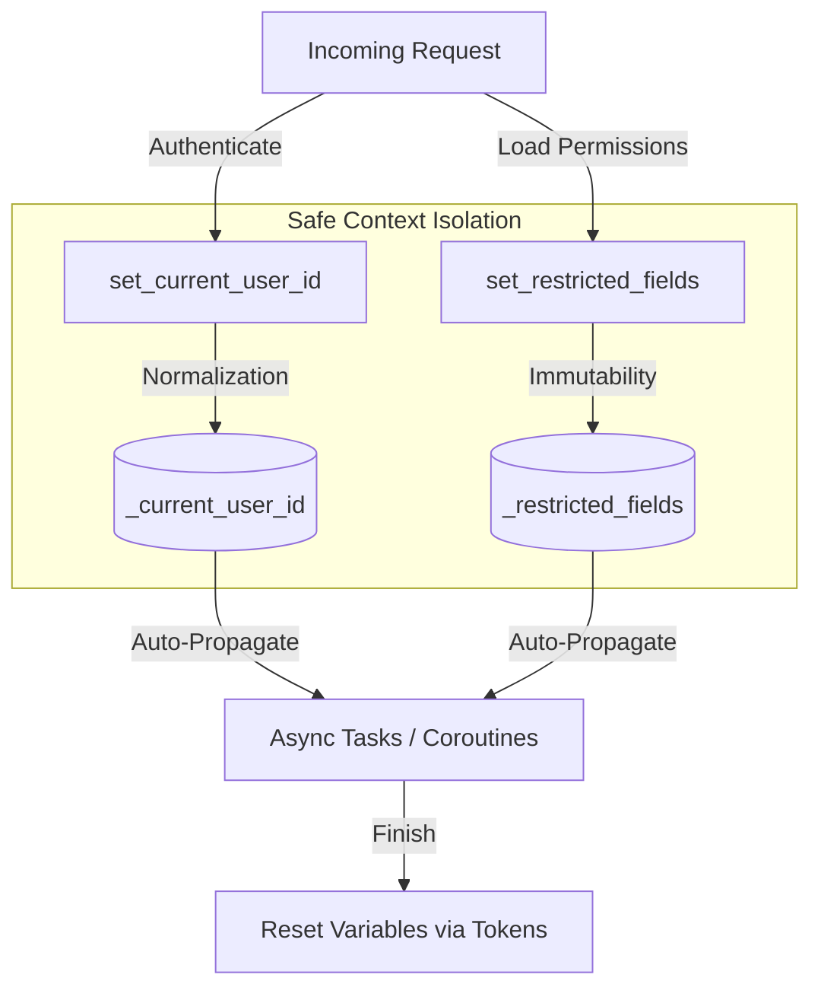

# 🧠 Thread-Safe Context Management

ZCore provides a modest but essential system for managing request and user states across asynchronous boundaries using Python's `contextvars` library. This ensures that authenticated user IDs and security restrictions are tracked safely across coroutines, preventing "state leakage" between concurrent requests.

---

## 📐 Technical Architecture

The context management system relies on thread-safe and coroutine-safe variables. These act like "global variables" that are private to each specific execution path (a single HTTP request or a background task).

*   🆔 **`_current_user_id`**: Stores the unique identifier (UUID) of the authenticated user.
*   🛡️ **`_restricted_fields`**: Stores an immutable set of fields that should be hidden or blocked for the current context.



---

## 🛡️ Safe Context Setters

To ensure data integrity, ZCore's context setters perform two modest but important transformations:

1.  **UUID Normalization**: When you set a user ID, ZCore automatically converts string inputs into proper `uuid.UUID` objects. This prevents "type mismatch" errors in your database queries later.
2.  **Immutability Enforcement**: The `set_restricted_fields` helper converts lists or sets into a `frozenset`. This ensures that once a request starts, the list of restricted fields cannot be accidentally modified by other parts of the application.

---

## 📋 Restricted Fields Syntax

Restricted fields are defined using the `{db_name}.{field}` syntax. The `db_name` corresponds to the `__db_name__` class attribute defined on your `Zchema` subclass:

```python
# Setting restricted fields with domain-specific namespaces
set_restricted_fields({
    "user.email",        # Restricts the "email" field in the "user" domain
    "product.price",     # Restricts the "price" field in the "product" domain
    "employee.salary"    # Restricts the "salary" field in the "employee" domain
})
```

!!! tip "💡 Why `{db_name}.{field}`?"
    The previous `resource.` prefix syntax caused namespace collisions across different domains. The new `{db_name}.{field}` syntax ensures strict domain boundary isolation, preventing fields in the `billing` module from accidentally affecting fields in the `crm` module.

### 🔄 Backward Compatibility

The old `resource.` prefix syntax is still supported for backward compatibility. ZCore normalizes `resource.<field>` paths by stripping the `resource.` prefix before resolving them against `__db_name__`. However, migrating to the new `{db_name}.{field}` syntax is strongly recommended.

---

## 📋 Context Managers Reference

ZCore provides three context managers to safely handle states. They use "Tokens" to ensure that when a block of code finishes, the context is restored to exactly how it was before.

| Context Manager | Parameters | Practical Use Case |
| :--- | :--- | :--- |
| **`user_context`** | `user_id` | Temporarily "impersonating" a user during a background job. |
| **`restricted_fields_context`** | `fields` | Overriding field visibility for a specific logic block. |
| **`request_context`** | `user_id`, `fields` | **Primary:** Used by middlewares to initialize the entire request state. |

---

## 💻 Practical Usage

Using these context managers ensures that you don't have to pass `user_id` as a parameter through every single function in your application.

```python
from zcore.context import request_context, get_current_user_id

# 1. Define the context boundary
with request_context(
    user_id="d3b07384-d113-495d-9c31-72f1aa11a43a", 
    fields=["employee.salary", "employee.internal_notes"]
):
    # 2. Any function called inside here can access the context
    uid = get_current_user_id()
    print(f"Executing task for user: {uid}")

# 3. Once the 'with' block exits, the context is automatically cleared.
```

---

## 💡 Engineering Insights

!!! tip "💡 Asynchronous Task Safety"
    Because ZCore uses `contextvars`, Python automatically "copies" these values to any nested async tasks (like those created with `asyncio.create_task`). This means your background operations stay just as secure as your main request thread.

!!! info "🛡️ Middleware Integration"
    In a standard ZCore project, the `RequestLogMiddleware` and `ScopedDependencyMiddleware` use these context tools to ensure that your log entries always include the correct `request_id` and `user_id` automatically.

!!! note "🧠 Manual Overrides"
    While ZCore manages most context automatically, you can use `user_context(None)` to explicitly run a block of code as an "Anonymous" user, which is useful for public-facing system tasks.