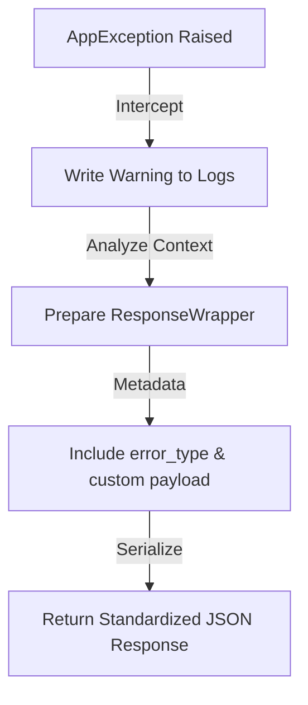

# 🛡️ Exception Handling

ZCore manages errors with a modest, structured approach. Instead of letting raw Python errors crash your request or leak internal details, ZCore catches domain-specific exceptions and transforms them into standardized, client-friendly JSON responses.

---

## 📋 Custom Exception Hierarchy

The framework provides a dedicated exception hierarchy where every error inherits from `AppException`. This design allows you to map business failures directly to standard HTTP status codes.

| Exception Class | HTTP Code | Practical Use Case |
| :--- | :--- | :--- |
| 🛑 **`AppException`** | `500` | Generic fallback for unhandled internal failures. |
| 🔍 **`EntityNotFound`** | `404` | When a specific ID or resource does not exist in the DB. |
| ♊ **`DuplicateEntity`** | `409` | When a unique constraint (like a duplicate email) is violated. |
| 🔑 **`AuthError`** | `401` | When credentials are missing, invalid, or expired. |
| 🚫 **`ForbiddenError`** | `403` | When a user is logged in but lacks required permissions. |
| ⚠️ **`ValidationError`** | `400` | When business rules are violated (e.g., "Price cannot be zero"). |

---

## 🛠️ Central Exception Handler

ZCore utilizes a global handler (`app_exception_handler`) to intercept any `AppException` raised within your services, repositories, or routers. This ensures that your API remains predictable and never returns a "Broken HTML" page for an error.



### 🪵 Transparent Logging
Whenever an exception is caught, ZCore logs a diagnostic warning. This allows you to monitor failures in production without exposing sensitive tracebacks to the end-user.

```python
# Standardized Error Envelope returned to the client:
{
  "success": false,
  "message": "Insufficient stock available.",
  "data": null,
  "meta": {
    "error_type": "ValidationError",
    "payload": { "available": 2, "requested": 10 }
  }
}
```

---

## 💻 Practical Usage

We suggest raising these exceptions inside your **Service Layer** to communicate business failures clearly.

```python
from zcore.exceptions.base import ValidationError, EntityNotFound

async def process_order(item_id: str, quantity: int):
    # 1. Check if resource exists
    item = await repository.get(item_id)
    if not item:
        raise EntityNotFound(message=f"Product '{item_id}' was not found.")
        
    # 2. Validate business constraints
    if item.stock < quantity:
        raise ValidationError(
            message="Not enough items in stock.",
            payload={"stock": item.stock, "requested": quantity}
        )
```

---

## 💡 Engineering Insights

!!! tip "💡 Structural vs. Business Validation"
    Use **Pydantic Schemas** for structural validation (e.g., "Is this an email?"). Use **`ValidationError`** inside your Service for business validation (e.g., "Is this email already taken?"). This keeps your layers clean and specialized.

!!! info "🛡️ Payload Flexibility"
    The `payload` parameter in `AppException` is a modest dictionary. You can use it to return specific field errors, error codes, or helpful hints to the frontend developer, all wrapped inside the `meta` field of the response.

!!! warning "🧹 Fail-Fast Philosophy"
    ZCore encourages "Failing Fast." As soon as a business rule is violated, raise the appropriate exception. The `UnitOfWork` will automatically detect this and rollback any pending database changes, ensuring your data stays consistent.
