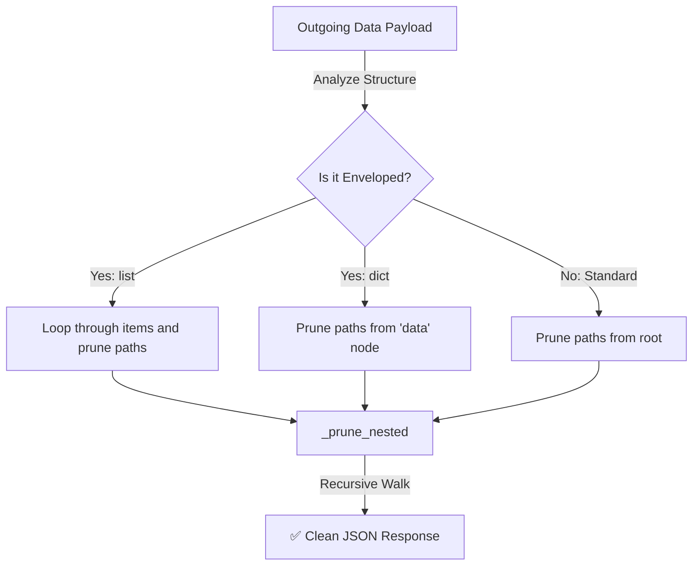

# 🛡️ Response Shielding & API Envelopes

ZCore provides a modest but critical safety net for your data through two specialized layers: the **`ResponseProjector`**, which prunes restricted fields in real-time, and the **`ResponseWrapper`**, which ensures every API response follows a predictable, standardized structure.

---

## ✂️ The Response Projector (`ResponseProjector`)

Data privacy is a core concern in modern APIs. The `ResponseProjector` acts as an automated "shield" that recursively walks through your outgoing data and removes any keys that match the active context's `restricted_fields`.

### 📐 Execution Architecture



### 🧠 Recursive Data Pruning
The projector is engineered to handle complex, nested data structures. Whether you are returning a single SQLAlchemy model or a deeply nested list of dictionaries, the projector follows the dot-path rules (e.g., `owner.internal_id`) and removes unauthorized nodes.

| Feature | Behavior | Benefit |
| :--- | :--- | :--- |
| **Recursive Depth** | Traverses nested dicts and lists. | Handles complex relations (e.g., `category.tags.id`). |
| **Context Aware** | Uses `get_restricted_fields()`. | Different users see different versions of the same data. |
| **Serialization Safety** | Uses `json_dumps` internally. | Safely handles UUIDs and Decimals before pruning. |

---

## 📦 Standardized Response Envelope (`ResponseWrapper`)

Consistency is a gift to frontend developers. ZCore ensures that every successful or failed request follows a predictable "Envelope" structure. This reduces the amount of error-handling code needed on the client side.

### 📝 Example Response Structure
```json
{
  "success": true,
  "message": "Operation completed successfully",
  "data": {
    "id": "e4c02f06-d71d-4876-88b0-a3e390c58a62",
    "name": "Heavy Duty Widget",
    "price": 249.99
  },
  "meta": {
    "execution_time_ms": 12.4
  }
}
```

### 💉 Pydantic Generic Support
The `ResponseWrapper` uses Pydantic **Generics**. This means your API documentation (Swagger/OpenAPI) remains perfectly type-safe. If your endpoint returns a `Product`, the documentation will show `ResponseWrapper[Product]`, making it clear what the `data` field contains.

---

## 💻 Practical Usage

While ZCore's `BaseRouter` handles enveloping automatically, you can manually construct envelopes for custom endpoints:

```python
from zcore.web.response import ResponseWrapper

@app.get("/custom-stats")
async def get_stats():
    stats_data = {"active_users": 150, "uptime": "99.9%"}
    
    # Manually wrap your data in a standardized success response
    return ResponseWrapper.success_response(
        data=stats_data, 
        message="System statistics retrieved successfully"
    )
```

---

## 💡 Engineering Insights

!!! tip "💡 Why "resource." in paths?"
    You may notice restricted fields often start with `resource.`. This is a ZCore convention that helps the `ResponseProjector` distinguish between system-level metadata and the actual data objects (resources) you are returning.

!!! info "🛡️ Performance & Latency"
    Pruning happens during the JSON rendering phase. ZCore is optimized to perform this work only once per request. By combining the `ResponseProjector` with the `ZCoreJSONResponse` class, we ensure that data is cleaned as it is converted to bytes for the network.

!!! note "🧠 Handling Empty Data"
    If an endpoint returns `None` (for example, after a successful deletion), the `ResponseWrapper` will still return a success status with `data: null`. This consistency ensures that frontend JSON parsers don't crash when expecting a specific structure.
