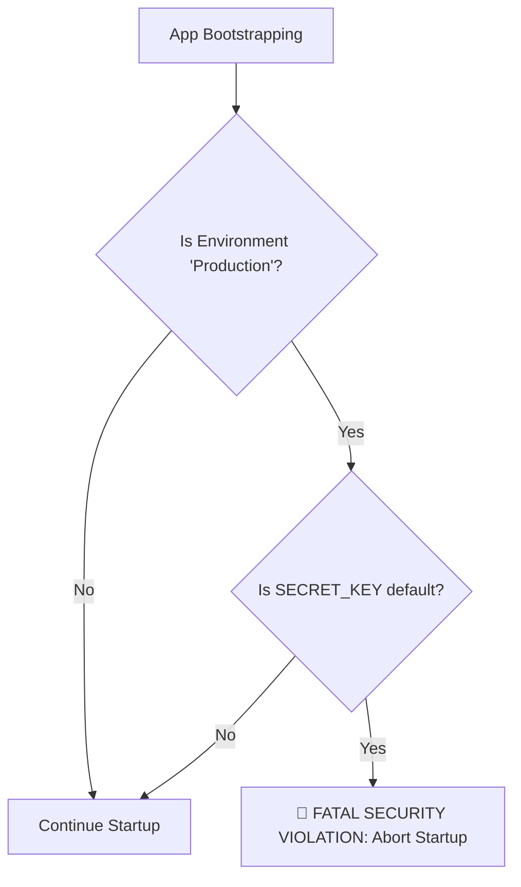

# 🛡️ Cryptographic Protocols & Security

ZCore takes a modest and practical approach to security. It comes equipped with industry-standard protocols for password protection and identity management, ensuring your application follows modern safety guidelines without requiring complex manual configuration.

---

## 🔒 Argon2id Password Hashing

For password security, ZCore utilizes **Argon2id**. This is currently considered a modern standard because it is specifically designed to be resistant to both brute-force attacks and highly specialized GPU-based cracking.

### ⚙️ Default Security Parameters
The Argon2 engine is pre-configured with high-security defaults. These values ensure a strong defense while remaining efficient for modern server hardware:

| Parameter | Default Value | Purpose |
| :--- | :--- | :--- |
| **Memory Cost** | `65536` (64 MB) | Forces the attacker to use significant RAM for each guess. |
| **Time Cost** | `3` Iterations | Determines the number of passes over the memory. |
| **Parallelism** | `4` Threads | Utilizes multi-core processing for hashing. |

### 🛡️ Side-Channel Protection
To prevent "Timing Attacks" (where an attacker guesses a password by measuring how long the server takes to respond), ZCore's verification function always returns a boolean outcome safely. It swallows internal cryptographic errors to ensure the execution time remains consistent.

```python
# Internal safety logic
try:
    return ph.verify(hashed_password, plain_password)
except (VerifyMismatchError, InvalidHashError):
    return False # Consistent failure response
```

---

## 🔑 JSON Web Tokens (JWT)

ZCore provides a modest wrapper for managing JWTs, supporting two primary modes of operation depending on your infrastructure needs:

1.  **Symmetric (HMAC):** A simple approach using a shared `SECRET_KEY`. Ideal for smaller, single-service applications.
2.  **Asymmetric (RSA/ECDSA):** A more advanced approach using a Private/Public key pair. This allows other services to verify tokens using your public key without knowing your private signing key.

---

## 🚨 The Production "Safety Shield"

A common engineering mistake is accidentally deploying an application to production with a default "test" secret key. ZCore implements a **Fatal Startup Guard** to prevent this.

If the framework detects it is running in a `production` environment while still using the insecure default key, it will immediately abort the startup sequence.



---

## 💻 Practical Usage

### 1. Handling Passwords
We suggest hashing passwords at the point of registration and verifying them only during the login phase.

```python
from zcore.security import get_password_hash, verify_password

# 📝 During User Registration:
hashed_pw = get_password_hash("user-password-123")

# 🔍 During User Login:
if verify_password("user-password-123", hashed_pw):
    print("✅ Access Granted")
```

### 2. Issuing Tokens
Tokens can carry custom "Claims" (data) such as the user ID or specific permission scopes.

```python
from zcore.security import create_token, decode_token

# 📤 Create a token (Default expiry: 30 minutes)
token = create_token(data={"sub": "user_id_123", "role": "admin"})

# 📥 Decode and validate a token
try:
    payload = decode_token(token)
    user_id = payload.get("sub")
except AuthError as e:
    print(f"❌ Validation failed: {e.message}")
```

---

## 💡 Engineering Insights

!!! tip "💡 Why Argon2id?"
    Unlike older algorithms (like MD5 or SHA1), Argon2id is "memory-hard." This makes it extremely expensive for attackers to build specialized hardware to crack your users' passwords.

!!! info "🛡️ Token Expiration"
    ZCore's `decode_token` automatically checks the `exp` (expiration) claim. If the token is even one second past its limit, it will raise an `AuthError`. You don't need to manually check timestamps.

!!! warning "🔑 Asymmetric Setup"
    To use Asymmetric signing, you must provide `JWT_PRIVATE_KEY` and `JWT_PUBLIC_KEY` in your settings. If these are missing, ZCore gracefully falls back to Symmetric (HMAC) signing using your `SECRET_KEY`.
