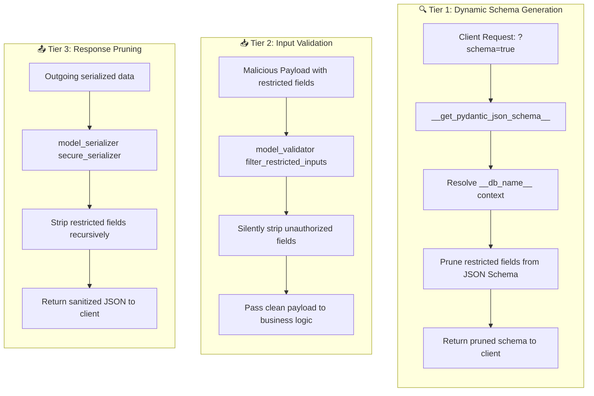

# 🛡️ Unified Schema Pruning & Security (`Zchema`)

ZCore provides a modest but powerful security layer that lives directly inside your Pydantic schemas. Instead of relying on web-layer middlewares or a separate `ResponseProjector` to prune data after rendering, ZCore introduces the `Zchema` base class — a drop-in replacement for Pydantic's `BaseModel` that automatically secures your data at three distinct tiers.

---

## 🧱 The `Zchema` Base Class

`Zchema` extends Pydantic V2's native hooks to inject security directly into the schema lifecycle. Every schema you define should inherit from `Zchema` instead of `BaseModel`:

```python
from zcore import Zchema

class UserBase(Zchema):
    __db_name__ = "user"
    email: str
    salary: float
```

### 🏷️ The `__db_name__` Attribute

The `__db_name__` class attribute binds the schema to a specific database domain. This is the foundation of ZCore's domain-isolated security model:

*   **Namespace Isolation:** Restricted fields are defined as `{db_name}.{field}` (e.g., `user.email`, `order.total`), preventing collisions between modules.
*   **Scoped Resolution:** The security layer uses `__db_name__` to determine which restricted paths apply to which schema, ignoring fields from unrelated domains.
*   **Backward Compatibility:** The old `resource.` prefix syntax is still supported as a fallback, but the new `{db_name}.` syntax is the recommended approach.

---

## 🔐 Three-Tier Security Model

`Zchema` automatically protects your data across three independent tiers, all without any web-layer middleware configuration:



### 🔍 Tier 1: Dynamic Schema Generation

When a client appends `?schema=true` to an endpoint URL, ZCore dynamically generates the JSON Schema for the target model. The `Zchema.__get_pydantic_json_schema__` hook intercepts this process and removes any properties that match the active context's restricted fields, ensuring that even the schema metadata doesn't leak information about hidden fields.

### 📥 Tier 2: Input Validation (Mass Assignment Prevention)

A malicious user could try to send restricted fields (e.g., `is_admin: true`) in a POST or PUT request body. The `model_validator` (`filter_restricted_inputs`) silently strips these fields before they ever reach your service layer, effectively preventing Mass Assignment attacks without any additional code.

### 📤 Tier 3: Response Pruning

During serialization, the `model_serializer` (`secure_serializer`) intercepts the output and recursively removes any keys that match the active context's restricted fields. Unlike the old `ResponseProjector` approach — which operated on raw JSON after rendering — this happens **natively within the model**, making it compatible with any serialization pipeline.

---

## 💻 Practical Usage

### Defining Schemas with Domain Binding

```python
from zcore import Zchema
from pydantic import Field, ConfigDict
import uuid

class EmployeeResponse(Zchema):
    __db_name__ = "employee"
    id: uuid.UUID
    name: str
    salary: float            # Will be pruned for non-admin users
    bank_account_number: str # Will be pruned for non-admin users

    model_config = ConfigDict(from_attributes=True)
```

### Setting Restricted Fields in Context

Restricted fields are defined using the `{db_name}.{field}` syntax and bound to the request context via middleware or a dependency:

```python
from zcore.context import set_restricted_fields

# In a security dependency or middleware:
set_restricted_fields({"employee.salary", "employee.bank_account_number"})
```

ZCore will automatically resolve these paths against the `__db_name__` of any schema being serialized. If the domain matches, the corresponding fields are pruned across all three security tiers.

---

## 📦 Standardized Response Envelope (`ResponseWrapper`)

The `ResponseWrapper` class itself inherits from `Zchema`, meaning it also participates in the security pruning pipeline:

```python
from zcore.web.response import ResponseWrapper

@app.get("/custom-stats")
async def get_stats():
    stats_data = {"active_users": 150, "uptime": "99.9%"}
    
    # Manually wrap your data in a standardized success response
    return ResponseWrapper.success_response(
        data=stats_data, 
        message="System statistics retrieved successfully"
    )
```

### 📝 Example Response Structure

```json
{
  "success": true,
  "message": "Operation completed successfully",
  "data": {
    "id": "e4c02f06-d71d-4876-88b0-a3e390c58a62",
    "name": "Heavy Duty Widget",
    "price": 249.99
  },
  "meta": {
    "execution_time_ms": 12.4
  }
}
```

### 💉 Pydantic Generic Support

The `ResponseWrapper` uses Pydantic **Generics**. This means your API documentation (Swagger/OpenAPI) remains perfectly type-safe. If your endpoint returns a `Product`, the documentation will show `ResponseWrapper[Product]`, making it clear what the `data` field contains.

---

## 💡 Engineering Insights

!!! tip "💡 Why `Zchema` Instead of `ResponseProjector`?"
    The old `ResponseProjector` operated on raw JSON after rendering, which required a custom `ZCoreJSONResponse` class and introduced an extra deserialization/reserialization cycle. `Zchema` integrates security directly into Pydantic's native hooks — the pruning happens once, at the model level, without any web-layer middleware.

!!! info "🛡️ Domain Boundary Isolation"
    Because `__db_name__` ties each schema to a specific domain (e.g., `"user"`, `"product"`, `"order"`), there is zero risk of field name collisions between modules. A restricted path like `user.email` will never accidentally prune the `email` field from the `Product` schema.

!!! note "🧠 Handling Empty Data"
    If an endpoint returns `None` (for example, after a successful deletion), the `ResponseWrapper` will still return a success status with `data: null`. This consistency ensures that frontend JSON parsers don't crash when expecting a specific structure.