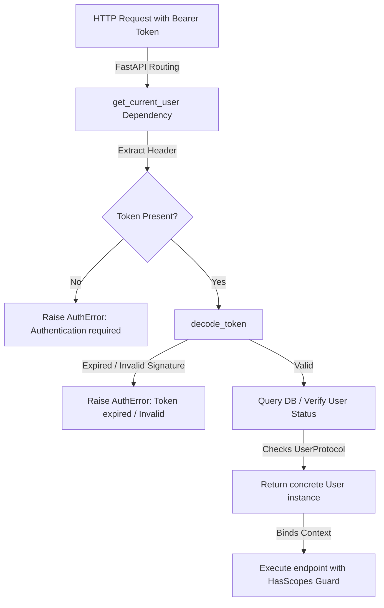

# 🔐 How-To: Enforcing Full JWT Authentication & Dynamic Scopes

## ❓ The Problem

By default, ZCore uses a placeholder stub dependency (`get_current_user_stub`) for route authorization checks. If you attempt to use route-level security guards out of the box, ZCore will raise a `NotImplementedError`. 

To secure your application, you need to implement a concrete token verification flow, bind your user model to ZCore's security requirements, and override the default stub dependency.

---

## 🛠️ The ZCore Solution

We suggest implementing a complete authentication flow using ZCore's JWT decoding utilities and registering it as a global FastAPI dependency override.



---

### 📦 Step 1: Implement the User Protocol

First, create a user class that implements ZCore's `UserProtocol`. The user model must provide `id`, `is_active`, `is_superuser`, and the dynamic property `all_scopes`:

```python
import uuid
from typing import Set
from sqlalchemy import String, Boolean, JSON
from sqlalchemy.orm import Mapped, mapped_column
from zcore.db.setup import Base

class User(Base):
    """Database representation matching ZCore's UserProtocol."""
    __tablename__ = "users"

    id: Mapped[uuid.UUID] = mapped_column(primary_key=True, default=uuid.uuid4)
    email: Mapped[str] = mapped_column(String(255), unique=True, index=True)
    is_active: Mapped[bool] = mapped_column(Boolean, default=True)
    is_superuser: Mapped[bool] = mapped_column(Boolean, default=False)
    scopes: Mapped[list[str]] = mapped_column(JSON, default=list) # e.g. ["products:view"]

    @property
    def all_scopes(self) -> Set[str]:
        """Compile and return the dynamic scope set for this user."""
        scopes_set = set(self.scopes)
        if self.is_superuser:
            # Grant superusers implicit system-wide privileges
            scopes_set.add("*")
        return scopes_set
```

---

### 🛡️ Step 2: Implement the Security Dependency

Next, create a security dependency that extracts the Bearer token from the HTTP `Authorization` header, decodes it using ZCore's `decode_token`, and validates the active user:

```python
from fastapi import Request, Depends
from fastapi.security import HTTPBearer, HTTPAuthorizationCredentials
from sqlalchemy import select

from zcore.exceptions.base import AuthError
from zcore.security.jwt import decode_token
from zcore.db.setup import get_db, AsyncSession
from .models import User

# Initialize standard Bearer token scheme extractor
security_scheme = HTTPBearer(auto_error=False)

async def get_current_user(
    credentials: HTTPAuthorizationCredentials = Depends(security_scheme),
    db: AsyncSession = Depends(get_db)
) -> User:
    """Validate incoming JWT credentials and return the active user model."""
    if not credentials or credentials.scheme.lower() != "bearer":
        raise AuthError(message="Authentication required. Please provide a Bearer token.")

    token = credentials.credentials
    # Decode the token (automatically raises AuthError if expired or malformed)
    payload = decode_token(token)
    user_id_str = payload.get("sub")

    if not user_id_str:
        raise AuthError(message="Invalid token structure: missing user identifier claims.")

    # Retrieve the user from the database
    query = select(User).where(User.id == user_id_str)
    result = await db.execute(query)
    user = result.scalars().first()

    if not user:
        raise AuthError(message="User account associated with this token was not found.")

    if not user.is_active:
        raise AuthError(message="User account is deactivated.")

    return user
```

---

### ⚙️ Step 3: Register the Dependency Override

In your `main.py` entry point, register your concrete dependency as an override for ZCore's authentication stub:

```python
from fastapi import FastAPI
from zcore.security.dependencies import get_current_user_stub
from .auth import get_current_user

app = FastAPI()

# Register the concrete override in FastAPI's dependency map
app.dependency_overrides[get_current_user_stub] = get_current_user
```

---

### 🚦 Step 4: Secure Your API Endpoints

With the dependency override in place, you can secure your endpoints using ZCore's `HasScopes` guard. The guard automatically checks if the resolved user possesses the required scopes:

```python
from fastapi import APIRouter, Depends
from zcore.security.permissions import HasScopes
from zcore.web.response import ResponseWrapper

router = APIRouter(prefix="/inventory", tags=["Inventory"])

# Secure a single endpoint with scope permissions
@router.post(
    "/",
    dependencies=[Depends(HasScopes("products:create"))],
    response_model=ResponseWrapper
)
async def create_inventory_item():
    return ResponseWrapper(message="Item created successfully")
```

---

## 💡 Engineering Insights

!!! tip "💡 Superuser Bypass"
    The `HasScopes` validator contains an `allow_superuser` configuration option (enabled by default). If set to `True`, the permission check is bypassed for users where `is_superuser` is `True`, allowing administrators unrestricted access.