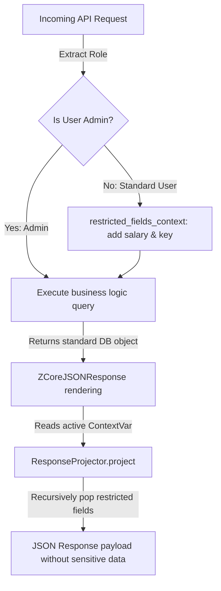

# 🎭 How-To: Role-Based Dynamic Field Masking

## ❓ The Problem

Many applications handle sensitive data (such as user salaries, bank details, or internal notes) that should only be visible to specific authorized roles (like administrators or HR). 

Instead of writing separate endpoints or complex database views for each role, you need a way to dynamically mask or prune sensitive fields from your API responses on the fly, without altering your core database models or query logic.

---

## 🛠️ The ZCore Solution

We suggest using ZCore's thread-safe `restricted_fields_context` along with the automated `ResponseProjector` layer. This setup intercepts API responses and dynamically prunes restricted fields before they are serialized and returned to the client.



---

### 📦 Step 1: Implement a Scoped Restriction Dependency

Create a FastAPI dependency that evaluates the authenticated user's permissions and binds restricted fields to the context. 

We suggest mapping restricted field dot-paths using the model's namespace (e.g., `resource.<field>`):

```python
from fastapi import Depends
from zcore.context import restricted_fields_context
from zcore.security.dependencies import get_current_user_stub
from zcore.security.protocols import UserProtocol

async def apply_security_field_restrictions(
    user: UserProtocol = Depends(get_current_user_stub)
) -> None:
    """Evaluate user roles and bind restricted fields to the active context."""
    restricted_paths = []

    # If the user is not a superuser, restrict sensitive fields
    if not getattr(user, "is_superuser", False):
        # We specify paths using the resource namespace
        restricted_paths.extend([
            "resource.salary",
            "resource.bank_routing_number",
            "resource.bank_account_number"
        ])

    # Bind the restricted paths to the request-scoped context
    # This context manager is automatically cleaned up when the request ends.
    restricted_fields_context(restricted_paths).__enter__()
```

---

### 🗄️ Step 2: Set Up Your Database Model & Router

Define your database model and route configurations as usual. ZCore's router automatically integrates with the custom response class:

```python
# models.py
import uuid
from sqlalchemy.orm import Mapped, mapped_column
from sqlalchemy import String, Numeric
from zcore.db.setup import Base

class Employee(Base):
    __tablename__ = "employees"

    id: Mapped[uuid.UUID] = mapped_column(primary_key=True, default=uuid.uuid4)
    name: Mapped[str] = mapped_column(String(100))
    salary: Mapped[float] = mapped_column(Numeric(10, 2), nullable=False, default=0.0)
    stock: Mapped[int] = mapped_column(Integer, nullable=False, default=0)
```

For the web layer, assign the permissions on the corresponding lifecycle actions:

```python
# routers.py
from zcore.web.base_router import BaseRouter, RouteKey
from zcore.db.pagination import PageNumberPagination

from .schemas import ProductCreate, ProductUpdate, ProductResponse
from .services import ProductService
from .models import Employee
from .security import apply_security_field_restrictions

class EmployeeRouter(BaseRouter[EmployeeCreate, EmployeeUpdate]):
    model = Employee
    create_schema = EmployeeCreate
    update_schema = EmployeeUpdate
    schema_out = EmployeeResponse
    service = EmployeeService
    
    prefix = "/employees"
    tags = ["Employees"]
    
    # Apply security restrictions as route dependencies
    GET_PERMISSIONS = [Depends(apply_security_field_restrictions)]
    GET_ALL_PERMISSIONS = [Depends(apply_security_field_restrictions)]
```

---

### 🧪 Step 3: Verification

When a non-admin user requests employee data (e.g. `GET /employees/{id}`), ZCore intercepts the response during rendering. 

Even if your service layer loads the full `Employee` database object with its salary and bank details, the outgoing JSON payload is dynamically pruned:

```json
{
  "success": true,
  "message": "Success",
  "data": {
    "id": "b1b0e363-26a1-438f-9aef-88df5ee47fa2",
    "name": "Alex Mercer"
    // salary and bank_account_number are automatically pruned!
  }
}
```

---

## 💡 Engineering Insights

!!! tip "💡 Caching Safety"
    ZCore's `ZCoreAPIRoute` automatically appends `Authorization` or `Cookie` parameters to the response's `Vary` header whenever restricted fields are active. This instructs upstream reverse-proxies that the response varies based on user credentials, preventing data leaks across shared caches.