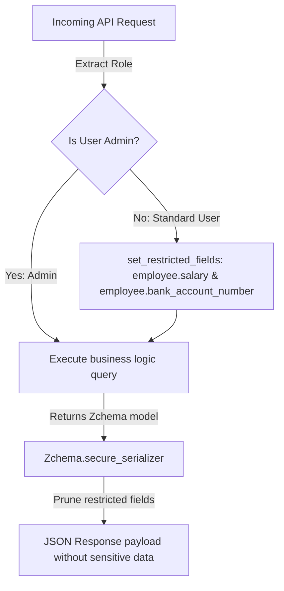

# 🎭 How-To: Role-Based Dynamic Field Masking

## ❓ The Problem

Many applications handle sensitive data (such as user salaries, bank details, or internal notes) that should only be visible to specific authorized roles (like administrators or HR). 

Instead of writing separate endpoints or complex database views for each role, you need a way to dynamically mask or prune sensitive fields from your API responses on the fly, without altering your core database models or query logic.

---

## 🛠️ The ZCore Solution

We suggest using ZCore's `Zchema` base class along with the thread-safe `restricted_fields_context`. The `Zchema` class automatically intercepts schema generation, input validation, and response serialization to prune restricted fields — all without any web-layer middleware.



---

### 📦 Step 1: Define Your Schema with `Zchema`

All schemas must inherit from `Zchema` and declare a `__db_name__` that binds them to their database domain:

```python
from zcore import Zchema
from pydantic import Field, ConfigDict
import uuid

class EmployeeResponse(Zchema):
    __db_name__ = "employee"
    id: uuid.UUID
    name: str
    salary: float            # Will be pruned for non-admin users
    bank_account_number: str # Will be pruned for non-admin users

    model_config = ConfigDict(from_attributes=True)
```

---

### 🛡️ Step 2: Implement a Scoped Restriction Dependency

Create a FastAPI dependency that evaluates the authenticated user's permissions and binds restricted fields to the context using the `{db_name}.{field}` syntax:

```python
from fastapi import Depends
from zcore.context import set_restricted_fields
from zcore.security.dependencies import get_current_user_stub
from zcore.security.protocols import UserProtocol

async def apply_security_field_restrictions(
    user: UserProtocol = Depends(get_current_user_stub)
) -> None:
    """Evaluate user roles and bind restricted fields to the active context."""
    restricted_paths = set()

    # If the user is not a superuser, restrict sensitive fields
    if not getattr(user, "is_superuser", False):
        # Use the domain-specific namespace: {db_name}.{field}
        restricted_paths.update([
            "employee.salary",
            "employee.bank_routing_number",
            "employee.bank_account_number"
        ])

    # Bind the restricted paths to the request-scoped context
    set_restricted_fields(restricted_paths)
```

---

### 🗄️ Step 3: Set Up Your Database Model & Router

Define your database model and route configurations as usual. ZCore's router automatically integrates with the `Zchema` security pipeline:

```python
# models.py
import uuid
from sqlalchemy.orm import Mapped, mapped_column
from sqlalchemy import String, Numeric
from zcore.db.setup import Base

class Employee(Base):
    __tablename__ = "employees"

    id: Mapped[uuid.UUID] = mapped_column(primary_key=True, default=uuid.uuid4)
    name: Mapped[str] = mapped_column(String(100))
    salary: Mapped[float] = mapped_column(Numeric(10, 2), nullable=False, default=0.0)
    stock: Mapped[int] = mapped_column(Integer, nullable=False, default=0)
```

For the web layer, inject the security restrictions via the `get_route_dependencies` method:

```python
# routers.py
from typing import Any
from zcore.web.base_router import BaseRouter, RouteKey
from zcore.db.pagination import PageNumberPagination

from .schemas import EmployeeCreate, EmployeeUpdate, EmployeeResponse
from .services import EmployeeService
from .models import Employee
from .security import apply_security_field_restrictions

class EmployeeRouter(BaseRouter[EmployeeCreate, EmployeeUpdate]):
    model = Employee
    create_schema = EmployeeCreate
    update_schema = EmployeeUpdate
    schema_out = EmployeeResponse
    service = EmployeeService
    
    prefix = "/employees"
    tags = ["Employees"]

    def get_route_dependencies(self, route_key: RouteKey, action: str) -> list[Any]:
        """Inject field restriction dependencies for view operations."""
        if route_key in (RouteKey.GET, RouteKey.GET_ALL):
            return [Depends(apply_security_field_restrictions)]
        return super().get_route_dependencies(route_key, action)
```

---

### 🧪 Step 4: Verification

When a non-admin user requests employee data (e.g. `GET /employees/{id}`), ZCore intercepts the response during serialization via the `Zchema.secure_serializer` hook.

Even if your service layer loads the full `Employee` database object with its salary and bank details, the outgoing JSON payload is dynamically pruned:

```json
{
  "success": true,
  "message": "Success",
  "data": {
    "id": "b1b0e363-26a1-438f-9aef-88df5ee47fa2",
    "name": "Alex Mercer"
    // salary and bank_account_number are automatically pruned!
  }
}
```

---

## 💡 Engineering Insights

!!! tip "💡 Why `{db_name}.{field}` Instead of `resource.{field}`?"
    The old `resource.` prefix caused namespace collisions across different domains. The new `{db_name}.{field}` syntax (e.g., `employee.salary`, `user.email`) ensures strict domain boundary isolation, preventing fields in the `billing` module from accidentally affecting fields in the `crm` module.

!!! info "🛡️ Three Tiers of Protection"
    `Zchema` doesn't just prune responses. It also:
    1. **Prunes JSON Schemas** when clients request `?schema=true`
    2. **Strips restricted fields from incoming payloads** (prevents Mass Assignment)
    3. **Prunes outgoing responses** during native Pydantic serialization

!!! note "🧠 Caching Safety"
    ZCore's `ZCoreAPIRoute` automatically appends `Authorization` or `Cookie` parameters to the response's `Vary` header whenever restricted fields are active. This instructs upstream reverse-proxies that the response varies based on user credentials, preventing data leaks across shared caches.