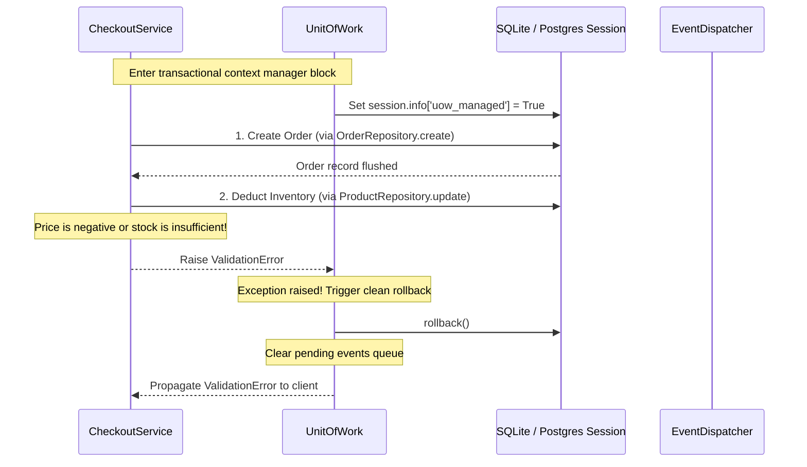

# 🔗 How-To: Atomic Transactions Across Multiple Repositories

## ❓ The Problem

In complex business scenarios, an API request often needs to update multiple database tables at once. For example, when checking out, you must insert an `Order` and deduct items from the `Product` inventory. 

If you commit each database modification separately, any failure halfway through the process (like running out of stock after the order is saved) will leave your database in an inconsistent state. To prevent this, you need to manage these changes atomically within a single transactional boundary.

---

## 🛠️ The ZCore Solution

We suggest using ZCore's `UnitOfWork` pattern to wrap multiple repositories in a single transactional block. This ensures that all database flushes are rolled back if any operation fails, and buffers any domain events until the transaction successfully commits.



---

### 💻 Implementation Example: The Checkout Flow

In the following example, the service uses `ProductRepository` and `OrderRepository` inside a `UnitOfWork` block to process checkouts atomically:

```python
import uuid
from zcore.service.base import BaseService
from zcore.db.uow import UnitOfWork
from zcore.kernel.di import Inject
from zcore.exceptions.base import ValidationError

from .models import Order
from .schemas import OrderCreate, OrderUpdate
from .repositories import OrderRepository, ProductRepository

class CheckoutService(BaseService[Order, OrderCreate, OrderUpdate]):
    
    def __init__(
        self,
        repository: OrderRepository = Inject(OrderRepository),
        product_repo: ProductRepository = Inject(ProductRepository)
    ) -> None:
        super().__init__(model=Order, repository=repository)
        self.product_repo = product_repo

    async def process_checkout(
        self, 
        user_id: uuid.UUID, 
        product_id: uuid.UUID, 
        quantity: int
    ) -> Order:
        """Process an order checkout atomically."""
        
        # 1. Access the request-scoped database session and the event dispatcher
        session = self.repository.db
        dispatcher = self.repository.db.info.get("event_dispatcher") # Fetched from kernel context

        # 2. Wrap operations in the UnitOfWork context manager
        async with UnitOfWork(session, dispatcher) as uow:
            
            # Fetch and check product inventory
            product = await self.product_repo.get(product_id)
            if not product or product.stock < quantity:
                raise ValidationError(message="Cannot complete checkout: insufficient product stock.")

            # Deduct items from product inventory (Repository changes are flushed, not committed)
            product.stock -= quantity
            await self.product_repo.db.flush()

            # Create the order record
            order_schema = OrderCreate(
                user_id=user_id,
                product_id=product_id,
                quantity=quantity,
                total_price=product.price * quantity
            )
            order = await self.repository.create(order_schema)

            # Register post-commit domain events with the Unit of Work
            uow.register_event("order.completed", {"order_id": str(order.id), "user_id": str(user_id)})
            
            # The context manager automatically commits the transaction here if no errors occurred
            return order
```

---

## 📐 Technical Insights

!!! note "🛡️ The Role of 'uow_managed'"
    During repository and service calls (like `self.repository.create`), ZCore checks if `self.repository.db.info["uow_managed"]` is set to `True`. Because the transaction is wrapped in a `UnitOfWork` block, individual repository commits are bypassed. The database session is only committed when the context manager block exits successfully.

!!! warning "⚠️ Handling Event Isolation"
    If the transaction rolls back, all registered events are discarded. If the transaction commits successfully, the events are dispatched. If any event listener fails during dispatching, the error is caught and logged, ensuring that listener failures do not affect the already committed database transaction.