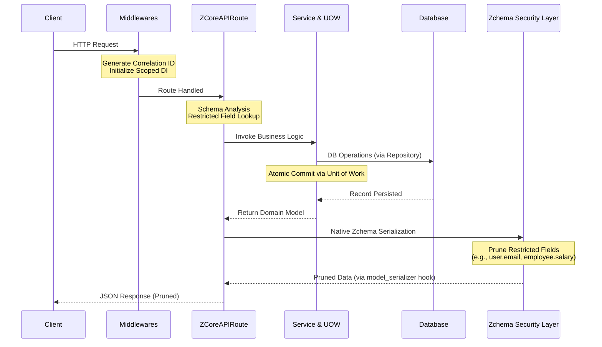

  
   

# Welcome to ZCore

ZCore is not a replacement for FastAPI; it is a modest and practical architectural layer built on top of it. While FastAPI provides the high-performance engine for handling HTTP requests, ZCore provides the "chassis"—a structured environment that solves common challenges in medium-to-large scale applications such as dependency management, transaction integrity, and data leakage prevention.

The framework focuses on **Engineered Simplicity**. It abstracts complex patterns like the *Unit of Work* and *Scoped Inversion of Control* into intuitive interfaces, allowing you to focus on your domain logic while the framework ensures that your database transactions are atomic and your sensitive data remains restricted based on the execution context.

---

## Why Choose ZCore?

ZCore was designed to bridge the gap between "writing an endpoint" and "building a maintainable system."

| Feature | Standard FastAPI Challenge | The ZCore Approach |
| :--- | :--- | :--- |
| **Dependency Injection** | Manual dependency registration and deeply nested `Depends` functions. | Automated **Scoped IoC** with constructor injection. |
| **Data Security** | Manual filtering of Pydantic models for different users. | **3-Tier Schema Security** via `Zchema` (generation, input, response). |
| **Transactions** | Scatterred `.commit()` calls leading to partial failures. | Centralized **Unit of Work** (UOW) for atomic operations. |
| **Project Structure** | Inconsistent layouts across different teams. | Modular **Plugin System** and standardized CLI scaffolding. |
| **Search & Filter** | Writing repetitive boilerplate for every query. | A secure, dynamic **Search Engine** with depth-limit protection. |

---

## The Request Lifecycle

Understanding how a request travels through ZCore is key to mastering its architecture. The following diagram illustrates the automated orchestration from the moment a request hits the server to the final pruned response.

💡 **Note:** `ZCoreAPIRoute` acts as a smart gateway, automatically intercepting requests and responses to handle schema inspection and dynamic field pruning — all delegated to the `Zchema` base class's native Pydantic V2 hooks.

---

## Core Pillars at a Glance

*   **⚡ Scoped IoC Container:** Manage object lifecycles (Singleton, Transient, or Scoped) with ease. Scoped dependencies are automatically cleared at the end of every HTTP request to prevent memory pollution.
*   **🛡️ Secure Search Engine:** A dynamic query builder that supports nested filters and eager-loading, while automatically blocking access to restricted database columns based on security policies.
*   **🔗 Unit of Work (UOW):** Ensures that business operations succeed or fail as a single unit. It coordinates database flushes and delays event dispatching until the transaction is successfully committed.
*   **🏗️ Modular Plugin System:** Organize your application into decoupled domains. Each plugin manages its own lifecycle hooks (`on_startup`, `on_shutdown`) and can declare dependencies on other plugins.

---

## Where to Start?

Choose the path that best fits your current needs:

!!! info "🚀 Quick Start"
    New to ZCore? Learn how to initialize your first project and create a modular app using our CLI tool in under 5 minutes.
    [View Quick Start Guide](learn/overview.md)

!!! tip "🧠 Architectural Deep Dive"
    Want to understand the "Under the Hood" mechanics? Explore our detailed documentation on Scoped DI, UOW, and the Kernel.
    [Explore Core Concepts](features/infrastructure/di/)

!!! warning "📜 Cheat Sheet"
    Already familiar with ZCore? Use our quick reference for syntax, CLI commands, and standard repository methods.
    [Open Cheat Sheet](cheatsheet.md)

---

    <small>ZCore is licensed under the Apache License 2.0. Built with ☕ and architectural rigor.</small>

