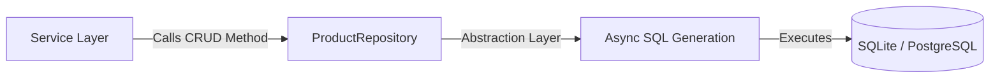

# 🏛️ Step 3: The Repository Layer

The repository layer acts as a modest bridge between your database and your business logic. In ZCore, we use the **Repository Pattern** to encapsulate data access. This ensures that your SQL queries are consistent, reusable, and isolated from the rest of your application.

Open `products/repositories.py` and configure the repository:

```python
from zcore.db.repository import BaseRepository
from zcore.db.setup import SessionDep

from .models import Product
from .schemas import ProductCreate, ProductUpdate

class ProductRepository(BaseRepository[Product, ProductCreate, ProductUpdate]):
    """Data Access Repository managing SQL operations for Products."""
    
    def __init__(self, db: SessionDep):
        # We pass the declarative model and the active async database session 
        # to the parent BaseRepository class
        super().__init__(model=Product, db=db)
```

---

## 🛠️ Instant CRUD Capabilities

By inheriting from `BaseRepository`, your `ProductRepository` immediately gains a set of standard asynchronous methods. You don't need to write raw SQL for common operations:

| Method | Action | Description |
| :--- | :--- | :--- |
| 🔍 `get(id)` | **Read** | Fetches a single record by its UUID. |
| 📚 `get_list()` | **Read** | Retrieves records with built-in pagination support. |
| ✨ `create(schema)` | **Write** | Validates the input and persists a new product. |
| 🛠️ `update(id, schema)` | **Write** | Safely applies changes to an existing record. |
| 🗑️ `delete(id)` | **Write** | Removes a record from the database. |

---

## 📐 Data Flow Visualization

The repository layer handles the translation between your Pydantic schemas and the SQLAlchemy models, keeping the communication between layers clean and predictable.



---

## 💡 Engineering Insights

!!! tip "💡 Reducing Boilerplate"
    The goal of the `BaseRepository` is to remove the "noise" of repetitive SQL code. Unless your application requires complex joins or specialized raw queries, this single file is often all you need for data management.

!!! info "🛡️ Type Safety"
    Because we pass the types `[Product, ProductCreate, ProductUpdate]` to the generic `BaseRepository`, your IDE will provide full auto-completion and type checking for all database operations, reducing runtime errors.

Now that our data access is ready, we will build the **Service Layer** to house our business rules.