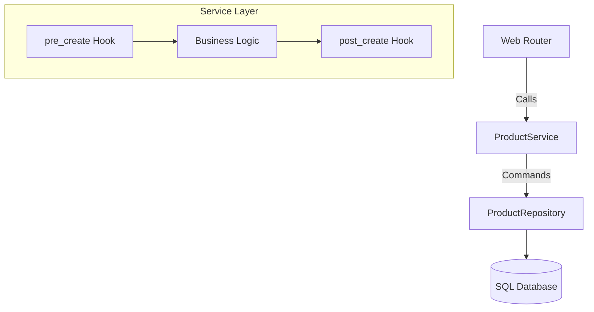

# ⚙️ Step 4: Business Service Layer

The service layer is the modest heart of your application. It is where you define your business rules and orchestrate data transactions. While the Repository handles **how** to talk to the database, the Service handles **what** happens to the data before and after it reaches the storage.

Open `products/services.py` and implement the service logic:

```python
from zcore.service.base import BaseService
from zcore.kernel.di import Inject
from zcore.exceptions.base import ValidationError

from .models import Product
from .schemas import ProductCreate, ProductUpdate
from .repositories import ProductRepository

class ProductService(BaseService[Product, ProductCreate, ProductUpdate]):
    """Service layer coordinating business transactions for the Product domain."""
    
    def __init__(self, repository: ProductRepository = Inject(ProductRepository)):
        # Inject the ProductRepository class dependency using our IoC Container
        super().__init__(model=Product, repository=repository)

    async def pre_create(self, schema: ProductCreate) -> None:
        """Lifecycle hook executed automatically before a database insert."""
        if "test" in schema.name.lower():
            raise ValidationError(
                message="Cannot create products with reserved placeholder names.",
                payload={"field": "name", "value": schema.name}
            )

    async def post_create(self, model: Product) -> None:
        """Lifecycle hook executed automatically after successful database insert."""
        # Ideal place for side-effects like sending emails or logs
        pass
```

---

## 🚦 Orchestration Flow

The service layer acts as the "manager," ensuring that data follows the correct path and validation rules before being persisted.



---

## 🛠️ Automated Dependency Injection

!!! info "💡 The `Inject` Mechanism"
    ZCore uses an Inversion of Control (IoC) container to manage dependencies. When you use `Inject(ProductRepository)`, the framework automatically finds the active database session and provides a ready-to-use repository instance. This keeps your code clean and makes testing much easier.

---

## 🎣 Lifecycle Hooks

ZCore provides hooks that wrap around standard database operations. These are designed to keep your code organized by separating validation from the actual data save.

| Hook | When it runs | Practical Example |
| :--- | :--- | :--- |
| ✨ `pre_create` | Before SQL Insert | Check for name duplicates or validate business rules. |
| ✅ `post_create` | After SQL Insert | Increment user stats or notify other systems. |
| 🛠️ `pre_update` | Before SQL Update | Verify if the product is not "locked" for edits. |
| 🔄 `post_update` | After SQL Update | Clear local cache records for this product. |
| 🗑️ `pre_delete` | Before SQL Delete | Ensure the product is not linked to active orders. |

---

!!! tip "🧠 Engineering Note: Transaction Safety"
    All write operations inside a service are handled atomically. If an exception is raised in `pre_create` or even during the SQL save, ZCore will automatically roll back the transaction, ensuring your database remains in a consistent state.

In the next step, we will expose this service to the outside world using the **Web Router**.