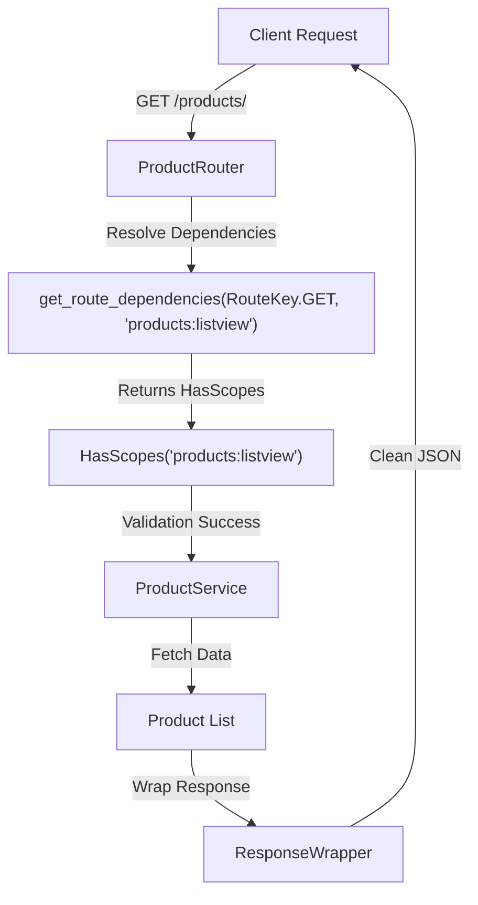

# 🌐 Step 5: Automated Web Routing

The routing layer is the final modest bridge that connects your business logic to the internet. ZCore's `BaseRouter` provides a standard way to scaffold common CRUD operations (POST, GET, PUT, PATCH, DELETE), ensuring that your API follows consistent patterns while handling security and pagination automatically.

Open `products/routers.py` and set up the web layer:

```python
from typing import Any
from zcore.web.base_router import BaseRouter, RouteKey
from zcore.db.pagination import PageNumberPagination

from .schemas import ProductCreate, ProductUpdate, ProductResponse
from .services import ProductService
from .models import Product

class ProductRouter(BaseRouter[ProductCreate, ProductUpdate]):
    """Scaffolded router exposing standard web operations for Products."""
    
    model = Product
    create_schema = ProductCreate
    update_schema = ProductUpdate
    schema_out = ProductResponse
    service = ProductService
    
    # Configure path context
    prefix = "/products"
    tags = ["Product Management"]
    
    # Expose raw JSON schemas to API clients (via ?schema=true)
    expose_schemas = True
    
    # Use standard offset-based page-number pagination
    pagination_class = PageNumberPagination

# Export the active router instance for registration
router_instance = ProductRouter()
```

---

## 🛠️ Scaffolded Endpoints Reference

By inheriting from `BaseRouter`, your application immediately provides the following endpoints. ZCore maps these to fine-grained security scopes based on the model's metadata:

| Method | Endpoint | Security Scope | Description |
| :--- | :--- | :--- | :--- |
| 🆕 `POST` | `/products/` | `products:create` | Creates a new product record. |
| 🔍 `GET` | `/products/{id}` | `products:view` | Retrieves details of a specific product. |
| 📚 `GET` | `/products/` | `products:listview` | Lists products with pagination. |
| 🧪 `POST` | `/products/search` | `products:listview` | Advanced filtering and searching. |
| 📝 `PUT` | `/products/{id}` | `products:update` | Full update of an existing product. |
| 🩹 `PATCH` | `/products/{id}` | `products:update` | Partial update (patch) of specific fields. |
| 🗑️ `DELETE` | `/products/{id}` | `products:delete` | Removes a product from the database. |

---

## 🎯 Unified Route Dependencies

ZCore has replaced the old static permission properties (`POST_PERMISSIONS`, `GET_PERMISSIONS`, etc.) with a single, elegant OOP method: `get_route_dependencies`.

This method receives the `RouteKey` and the computed `action` string, and returns a list of FastAPI dependencies. By default, it returns a `HasScopes(action)` dependency, which enforces the appropriate security scope.

### 🔧 Customizing Dependencies for Specific Routes

To override dependencies for a specific HTTP method, simply override `get_route_dependencies` and use `super()` to fall back to the default behavior for other routes:

```python
from typing import Any
from zcore.web.base_router import BaseRouter, RouteKey

class ProductRouter(BaseRouter[ProductCreate, ProductUpdate]):
    model = Product
    # ... other config

    def get_route_dependencies(self, route_key: RouteKey, action: str) -> list[Any]:
        """Override route dependencies with custom logic."""
        if route_key == RouteKey.DELETE:
            # Only admins can delete products
            return [Depends(AdminOnly())]
        
        # Fall back to standard scope-based dependencies for all other routes
        return super().get_route_dependencies(route_key, action)
```

!!! tip "🧠 Why `super()` Delegation?"
    By calling `super().get_route_dependencies(route_key, action)`, you inherit ZCore's automatic action-to-scope mapping for every route except the one you're customizing. This keeps your code DRY and ensures that new endpoints added in future versions of ZCore are automatically secured.

### 📋 Available `RouteKey` Values

| RouteKey | HTTP Method | Default Action |
| :--- | :--- | :--- |
| `RouteKey.POST` | `POST` | `{model}:create` |
| `RouteKey.GET` | `GET` | `{model}:view` |
| `RouteKey.GET_ALL` | `GET (list)` | `{model}:listview` |
| `RouteKey.SEARCH` | `POST /search` | `{model}:listview` |
| `RouteKey.UPDATE` | `PUT` | `{model}:update` |
| `RouteKey.PATCH` | `PATCH` | `{model}:update` |
| `RouteKey.DELETE` | `DELETE` | `{model}:delete` |

---

## 🚦 Request Execution Flow

The router doesn't just pass data; it acts as a security guard, ensuring the user has the correct scopes before any business logic is executed.



---

## 💡 Engineering Insights

!!! tip "💡 Pure OOP, No Magic"
    Unlike the old static property cascade (which used complex fallback logic to resolve `DEFAULT_PERMISSIONS` against individual route properties), the new `get_route_dependencies` method is resolved deterministically at startup time using standard Python inheritance and `super()` calls — zero runtime reflection overhead.

!!! info "🛡️ Dynamic Schema Exposure"
    By setting `expose_schemas = True`, you allow clients to call your endpoints with the `?schema=true` query parameter. ZCore will return the JSON Schema for that specific endpoint, which is useful for dynamic form generation or automated client-side validation.

!!! note "📦 Standardized Response Envelope"
    Consistency is key for frontend developers. ZCore automatically wraps every response in a `ResponseWrapper`. Your clients will always receive a predictable structure:
    ```json
    {
      "success": true,
      "message": "Success",
      "data": { ... },
      "meta": { ... }
    }
    ```

Now that our module is complete, we will package it as a reusable **Framework Plugin** in the final step.