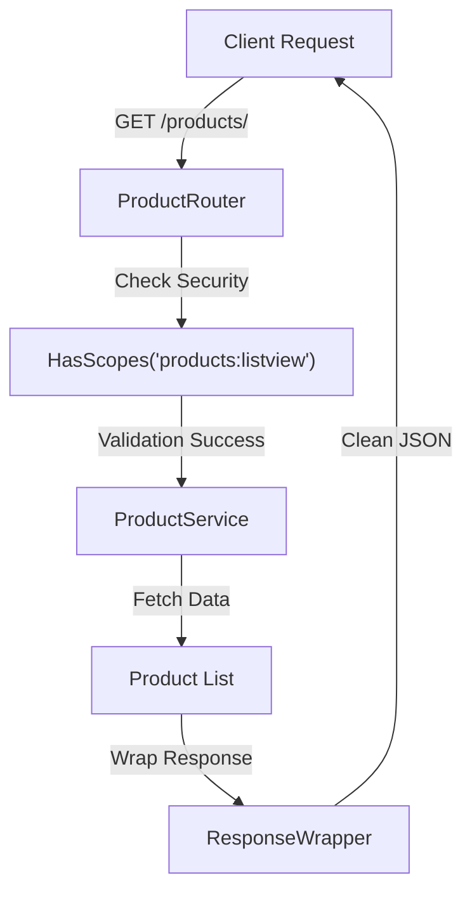

# 🌐 Step 5: Automated Web Routing

The routing layer is the final modest bridge that connects your business logic to the internet. ZCore’s `BaseRouter` provides a standard way to scaffold common CRUD operations (POST, GET, PUT, PATCH, DELETE), ensuring that your API follows consistent patterns while handling security and pagination automatically.

Open `products/routers.py` and set up the web layer:

```python
from zcore.web.base_router import BaseRouter, RouteKey
from zcore.db.pagination import PageNumberPagination

from .schemas import ProductCreate, ProductUpdate, ProductResponse
from .services import ProductService
from .models import Product

class ProductRouter(BaseRouter[ProductCreate, ProductUpdate]):
    """Scaffolded router exposing standard web operations for Products."""
    
    model = Product
    create_schema = ProductCreate
    update_schema = ProductUpdate
    schema_out = ProductResponse
    service = ProductService
    
    # Configure path context
    prefix = "/products"
    tags = ["Product Management"]
    
    # Expose raw JSON schemas to API clients (via ?schema=true)
    expose_schemas = True
    
    # Use standard offset-based page-number pagination
    pagination_class = PageNumberPagination

# Export the active router instance for registration
router_instance = ProductRouter()
```

---

## 🛠️ Scaffolded Endpoints Reference

By inheriting from `BaseRouter`, your application immediately provides the following endpoints. ZCore also maps these to fine-grained security scopes based on the model's metadata:

| Method | Endpoint | Security Scope | Description |
| :--- | :--- | :--- | :--- |
| 🆕 `POST` | `/products/` | `products:create` | Creates a new product record. |
| 🔍 `GET` | `/products/{id}` | `products:view` | Retrieves details of a specific product. |
| 📚 `GET` | `/products/` | `products:listview` | Lists products with pagination. |
| 🧪 `POST` | `/products/search` | `products:listview` | Advanced filtering and searching. |
| 📝 `PUT` | `/products/{id}` | `products:update` | Full update of an existing product. |
| 🩹 `PATCH` | `/products/{id}` | `products:update` | Partial update (patch) of specific fields. |
| 🗑️ `DELETE` | `/products/{id}` | `products:delete` | Removes a product from the database. |

---

## 🚦 Request Execution Flow

The router doesn't just pass data; it acts as a security guard, ensuring the user has the correct "Scopes" before any business logic is executed.



---

## 💡 Engineering Insights

!!! tip "💡 Standardized Response Envelope"
    Consistency is key for frontend developers. ZCore automatically wraps every response in a `ResponseWrapper`. This means your clients will always receive a predictable structure:
    ```json
    {
      "success": true,
      "message": "Success",
      "data": { ... },
      "meta": { ... }
    }
    ```

!!! info "🛡️ Dynamic Schema Exposure"
    By setting `expose_schemas = True`, you allow clients to call your endpoints with the `?schema=true` query parameter. ZCore will return the JSON Schema for that specific endpoint, which is useful for dynamic form generation or automated client-side validation.

Now that our module is complete, we will package it as a reusable **Framework Plugin** in the final step.