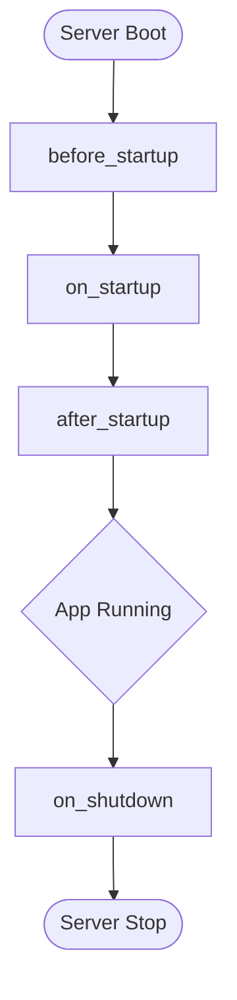

# 🏗️ Step 6: Domain Packaging (Plugins)

In ZCore, domain modules are packaged as reusable **Plugins**. Each plugin acts as a modest, self-contained unit that manages its own routing, lifecycle tasks, and internal setup. This ensures that your application remains modular and easy to maintain as it grows.

Open `products/plugin.py` and define the plugin wrapper:

```python
from fastapi import FastAPI
from zcore.kernel import Plugin
import structlog

from .routers import router_instance

logger = structlog.get_logger()

class ProductPlugin(Plugin):
    """Plugin wrapper packaging the Product Management domain."""
    
    name = "product_domain"
    version = "0.1.0"
    dependencies = [] # List required plugins (e.g. ['security_plugin'])

    def setup(self, app: FastAPI) -> None:
        """Register routes with the main FastAPI instance."""
        app.include_router(router_instance.router)
        logger.info("Product Router registered successfully.")

    async def before_startup(self) -> None:
        """Run operations before the web server starts."""
        logger.info("Product domain: preparing assets...")

    async def on_startup(self) -> None:
        """Run core startup logic (e.g. warming up caches)."""
        logger.info("Product domain: warming local product memory caches...")

    async def after_startup(self) -> None:
        """Run tasks after startup concludes."""
        pass

    async def on_shutdown(self) -> None:
        """Clean up resources when the application shuts down."""
        logger.info("Product domain: shutting down connections safely...")
```

---

## 📋 The Plugin Contract

Every plugin in ZCore follows a simple structure. This allows the core engine (Kernel) to coordinate multiple domains without them interfering with each other.

| Property / Method | Purpose |
| :--- | :--- |
| 🏷️ `name` | Unique identifier used for dependency resolution. |
| 🔢 `version` | Semantic versioning for internal tracking. |
| 🔗 `dependencies` | A list of other plugin names that must start before this one. |
| 🛠️ `setup()` | Synchronous configuration (Route registration, DI binding). |

---

## 🔄 Managing Application Lifecycles

ZCore provides several "hooks" that allow you to execute code at specific points in the application's life. This is safer than using global variables or loose scripts, as it ensures resources are handled in the correct order.



| Lifecycle Hook | Ideal Use Case |
| :--- | :--- |
| 🏁 `before_startup` | Pre-flight checks, verifying environment variables. |
| 🔥 `on_startup` | Warming up caches, establishing external connections. |
| ✨ `after_startup` | Diagnostic logging, health-check verification. |
| 🛑 `on_shutdown` | Closing database pools, flushing logs, releasing file locks. |

---

## 💡 Engineering Insights

!!! tip "💡 Why Use Plugins?"
    Modular design prevents "spaghetti code." By keeping your product logic inside its own plugin, you can easily move it to a different project or convert it into a standalone microservice later with minimal changes.

!!! info "🛡️ Dependency Resolution"
    If your `ProductPlugin` needs a `SecurityPlugin` to be active, simply add `"security_plugin"` to the `dependencies` list. ZCore's Kernel will automatically sort the plugins and ensure the security layer is ready before the product layer starts.

Now that our plugin is ready, we will look at how ZCore's **Kernel** coordinates these modules in the final bootstrapping step.