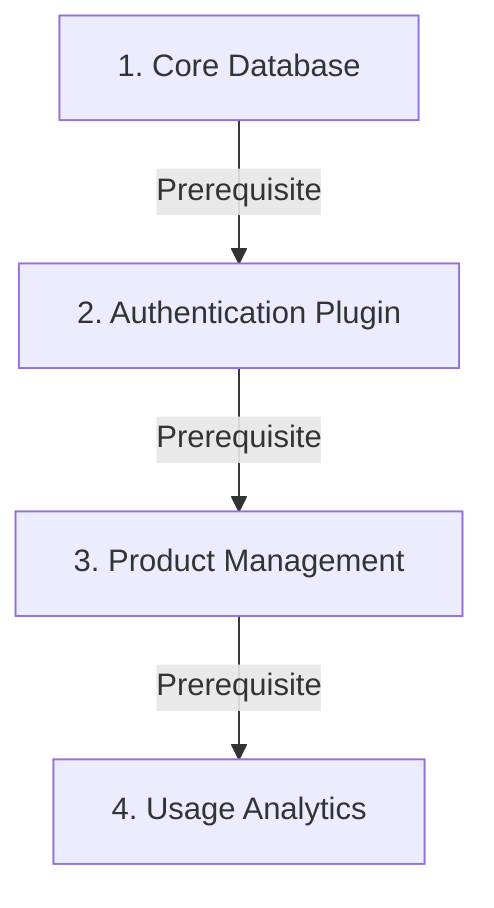

# 🧠 Step 7: Framework Orchestration (The Kernel)

The **Kernel** is the modest central coordinator of every ZCore application. It acts as the "brain" that manages your plugins, resolves their dependencies, and ensures that every part of your system starts and stops in the correct sequence.

---

## 🛠️ The Kernel's Responsibilities

Instead of manually importing and starting every module in your project, you hand them over to the Kernel. Here is a breakdown of what the Kernel handles for you:

| Task | Purpose |
| :--- | :--- |
| 🧩 **Plugin Registration** | Keeping track of all active domain modules. |
| 📐 **Dependency Analysis** | Figuring out which plugins need to start first. |
| ⏱️ **Lifespan Management** | Triggering the `startup` and `shutdown` hooks we defined in Step 6. |
| 💉 **Core Injection** | Registering global tools (like the Event Dispatcher) into the IoC container. |

---

## 📐 Topological Dependency Sorting

When you have a complex system, plugins often rely on one another. For example, a `PaymentPlugin` might require a `DatabasePlugin` to be ready first. 

The Kernel automatically analyzes the `dependencies` list of every plugin and builds a **Directed Acyclic Graph (DAG)**. It then sorts them "topologically." This is a modest way of saying it creates a perfect "to-do list" where every prerequisite is finished before the next step begins.



---

## 💻 Initializing the Kernel

To prepare your application, you simply create a Kernel instance and add your plugins to it. This usually happens in your `main.py` file:

```python
from zcore import Kernel
from products.plugin import ProductPlugin

# 1. Initialize the Kernel instance
kernel = Kernel()

# 2. Register your domain plugins
kernel.add_plugin(ProductPlugin())
```

---

## 💡 Engineering Insights

!!! info "🛡️ Safety Against Cyclic Loops"
    If you accidentally create a "circular dependency" (e.g., Plugin A depends on B, and B depends on A), the Kernel will detect this during startup and raise a `RuntimeError`. This prevents your application from entering an infinite loop or crashing in an unpredictable state.

!!! tip "💡 Decoupled Communication"
    The Kernel also manages the **Event Dispatcher**. This allows plugins to talk to each other without being "hard-coded" together. For example, the `ProductPlugin` can emit an event that the `AnalyticsPlugin` listens to, even if they don't know each other exists.

---

## 🔍 Troubleshooting the Kernel

If your application fails to start, check the following common modest mistakes:

*   **Missing Dependency:** You listed a dependency in `plugin.py`, but you forgot to register that plugin with `kernel.add_plugin()`.
*   **Startup Exception:** One of your plugins crashed inside `on_startup()`. Because the Kernel executes these in order, a crash in one plugin will safely prevent the rest of the system from starting in an unstable state.

In our final step, we will assemble all these pieces in `main.py` and launch the application!