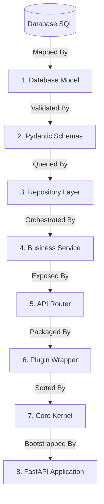

# 🗺️ Quickstart Overview: The Blueprint

Welcome to the ZCore Quickstart guide! This tutorial is designed to take you from a clean slate to a fully functional, structured, and maintainable REST API using ZCore's domain-driven approach.

To help you learn the framework effectively, we will build a continuous, real-world project: **The Product Management System**. This system will handle creating, retrieving, updating, searching, and deleting products with full transaction management, data validation, and safety controls.

---

## 🏗️ Why a "Bottom-Up" Engineering Approach?

ZCore's suggested design approach is **Bottom-Up**. We start from the physical database representation and move upward to the presentation layer. By establishing a solid foundation at the data layer, we ensure that schemas, repositories, and services remain tightly bound, type-safe, and highly predictable.

---

## 📊 Scenario Parameters

Our `Product` domain will manage the following metrics:

*   🆔 **ID:** Unique global identifier (UUIDv4).
*   📝 **Name:** The descriptive name of the item.
*   💰 **Price:** The retail value of the product (which must never be negative).
*   📦 **Stock:** The integer quantity of items physically available in inventory.

---

!!! info "💡 The Philosophy of Clean Abstractions"
    FastAPI provides the asynchronous routing engine; ZCore layers structural safety on top of it. In the following sections, we will walk through how each layer encapsulates a single responsibility, reducing boilerplate code and making your codebase easier to maintain.